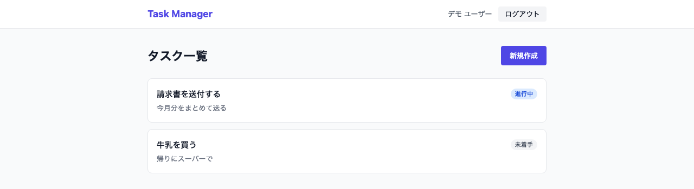
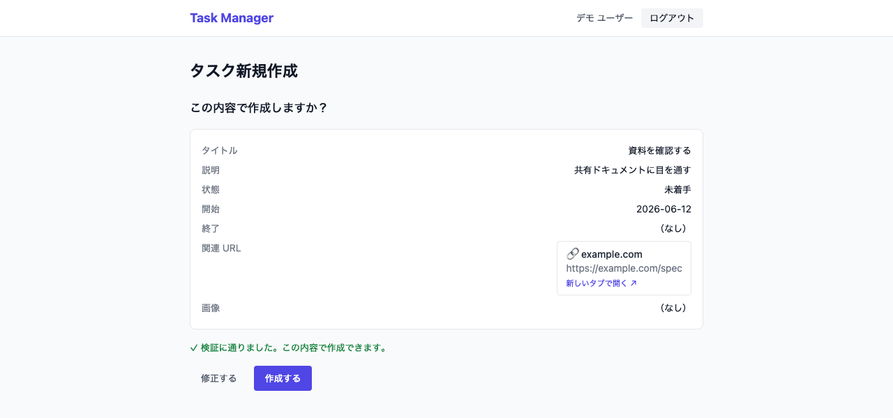

# nuxtjs-nestjs-test-practice

[](https://github.com/kojikawazu/nuxtjs-nestjs-test-practice/actions/workflows/ci.yml)

Nuxt.js + NestJS のテスト practice プロジェクト（タスク管理アプリ）

## 概要

テストコードの知見を深めることを主目的とした学習用モノレポ。題材としてタスク管理アプリを、各層で「どんなテストを・なぜ書くか」を学べる構成で実装している。

- FE: Nuxt 3 (SPA) / TailwindCSS / Composable / Nitro BFF
- BE: NestJS / TypeORM / レイヤードアーキテクチャ / MySQL
- 契約: TypeSpec → OpenAPI → 型/クライアント生成（`packages/`）
- テスト: Jest / supertest / Vitest / MSW / Vue Test Utils / Playwright

## 主な機能

- 認証: 登録 / ログイン / リフレッシュ（ローテーション）/ ログアウト（JWT。アクセスはメモリ、リフレッシュは httpOnly Cookie）
- タスク CRUD: 所有者のみ操作可。状態（todo/in_progress/done）、期間（開始必須・終了任意、開始≤終了）
- 事前検証（DryRun）: 保存せず入力を検証する `*/validate` エンドポイント
- 画像添付: タスクに 1 枚（任意・png/jpeg/webp・2MB まで）。`/uploads` で静的配信、保存先は volume で永続化
- 契約から生成した Swagger UI（`/docs`）

詳細な仕様は `docs/` を参照。

## スクリーンショット

| タスク一覧 | 作成時の確認画面（2 段階フロー） |
| --- | --- |
|  |  |

## 構成

```
apps/backend    NestJS API
apps/frontend   Nuxt 3 SPA + Nitro BFF
packages/api-spec    TypeSpec 契約 → OpenAPI
packages/api-client  生成した型 + openapi-fetch クライアント
```

## 前提環境

| 必要なもの | バージョン / 備考 |
| --- | --- |
| Node.js | 22 以上 |
| pnpm | 10.33（`package.json` の `packageManager` で固定） |
| Docker / Docker Compose | フルスタックで動かす場合に必要（backend 単体なら SQLite で代替でき不要） |

## セットアップ

```bash
pnpm install
cp .env.example .env
pnpm api:gen        # ← 必須: 契約から型/クライアントを生成
```

> ⚠️ **`pnpm api:gen` は必須**。実行しないと `@app/api-client` の型が未生成のままになり、FE/BE のビルド・型チェック・テストが失敗します（生成物は `.gitignore` 対象で、clone 直後には存在しません）。
>
> `make help` でよく使う操作の一覧を表示できます（`make up` / `make test` / `make gen` など）。

## まず動かす（クイックスタート）

一番簡単なのは Docker で全部まとめて起動する方法です。

```bash
docker compose up --build   # mysql + backend(:3001) + frontend(:3000)
```

- アプリ UI: http://localhost:3000
- Swagger UI（対話的 API ドキュメント）: http://localhost:3001/docs

## 個別に起動して開発する

```bash
# backend だけを Docker なしで（SQLite インメモリ・データは再起動で消える）
DB_TYPE=better-sqlite3 DB_DATABASE=:memory: pnpm --filter @app/backend dev

# MySQL を使う場合は先に DB を起動してから backend を起動
pnpm db:up
pnpm --filter @app/backend dev
```

> ℹ️ frontend の dev サーバ（`nuxt dev`）は現状 Vite 7 と非互換で起動しません。ローカルで画面を確認するときは `docker compose up --build`、または本番ビルド出力（`pnpm --filter @app/frontend build` → `node apps/frontend/.output/server/index.mjs`）を使ってください。

## テスト

```bash
pnpm --filter @app/backend test       # 単体(Jest)
pnpm --filter @app/backend test:e2e   # e2e(supertest / SQLite)
pnpm --filter @app/frontend test      # 単体(Vitest + MSW)
pnpm --filter @app/frontend test:e2e  # 全体E2E(Playwright)
```

上記は GitHub Actions（`.github/workflows/ci.yml`）で PR・`main` push 時に自動実行される（lint / format / typecheck も含む）。

## 開発・貢献

- 作業は必ず**ブランチを切ってから**着手する（`main` への直接コミットは禁止）。
- 実装にはテストを必ず添え、`pnpm lint` / `pnpm format:check` / 各種テストを通す。
- PR の承認・マージは人間が行う（自動マージ禁止）。詳細な開発ルールは `.claude/rules/`（workflow / testing / git / quality-gate など）を参照。

## ドキュメント

仕様書は `docs/` 配下に番号付きで整理している。開発ルールは `.claude/rules/` を参照。

### よくある探し物（クイックリンク）

| 知りたいこと | 参照先 |
|---|---|
| **初めてコードを読む / 起動コマンド・curl 例** | [docs/12-code-reading-guide/](docs/12-code-reading-guide/README.md) |
| **アーキテクチャ・構成**（何が動く？ 静的配信・volume・技術スタック） | [docs/09-architecture-specification.md](docs/09-architecture-specification.md) |
| **ポート番号・DB 切替・画像保存先**（3000 / 3001 / 3306 など） | [docs/10-miscellaneous-specification.md](docs/10-miscellaneous-specification.md) |
| **DB**（ER 図・テーブルスキーマ・`imageUrl`） | [docs/05-data-specification.md](docs/05-data-specification.md) |
| **セキュリティ**（認証・トークン保管・アップロード検証） | [docs/06-security-specification.md](docs/06-security-specification.md) |
| **API エンドポイント一覧 / Swagger** | [docs/07-api-specification.md](docs/07-api-specification.md) |
| **機能・画面遷移・確認画面（2段階）** | [docs/03-functional-specification.md](docs/03-functional-specification.md) |
| **テスト方針・各層のモック対象** | [docs/08-test-specification.md](docs/08-test-specification.md) |
| **進捗・CI** | [docs/11-tasks.md](docs/11-tasks.md) |

### ドキュメント一覧

| # | ファイル | 内容 |
|---|---|---|
| 01 | [business-requirements](docs/01-business-requirements.md) | 要求仕様（背景・目標・スコープ・制約） |
| 02 | [requirements-specification](docs/02-requirements-specification.md) | 要件仕様（機能要件一覧・受け入れ条件・優先度） |
| 03 | [functional-specification](docs/03-functional-specification.md) | 機能仕様（機能詳細・ユーザーフロー・UI/UX・業務ロジック） |
| 04 | [non-functional-specification](docs/04-non-functional-specification.md) | 非機能仕様（性能・可用性・信頼性・保守性） |
| 05 | [data-specification](docs/05-data-specification.md) | データ仕様（ER 図・スキーマ・ポータブル型） |
| 06 | [security-specification](docs/06-security-specification.md) | セキュリティ仕様（JWT・トークン保管・アップロード検証） |
| 07 | [api-specification](docs/07-api-specification.md) | API 仕様（エンドポイント・契約・Swagger UI） |
| 08 | [test-specification](docs/08-test-specification.md) | テスト仕様（各層の戦略・モック方針・カバレッジ） |
| 09 | [architecture-specification](docs/09-architecture-specification.md) | アーキテクチャ仕様（システム構成・静的配信/volume・技術スタック） |
| 10 | [miscellaneous-specification](docs/10-miscellaneous-specification.md) | その他（用語集・参照資料・付録: ポート/DB 切替/画像保存先） |
| 11 | [tasks](docs/11-tasks.md) | タスク・進捗・CI |
| 12 | [code-reading-guide](docs/12-code-reading-guide/README.md) | コードリーディングガイド（契約 → BE → FE → テストの読む順番。Step 別に分割） |
