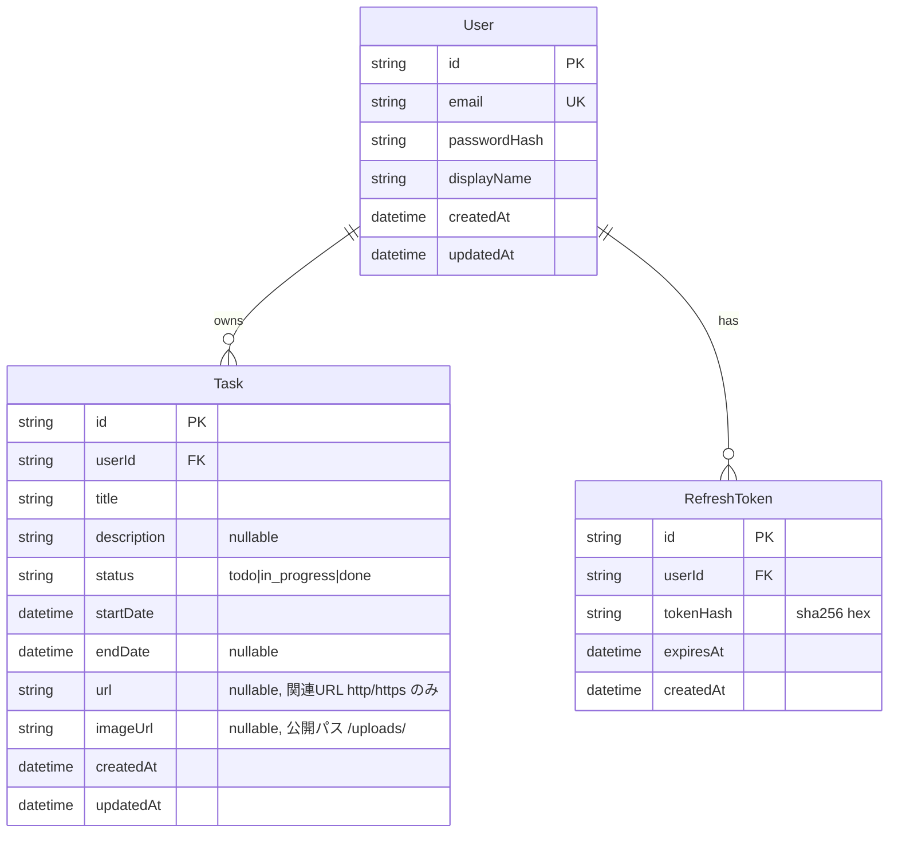

# データ仕様書

データモデル・DB スキーマ・データフローを定義する。実装は `apps/backend-layered` の TypeORM エンティティ。

## 目次

- [データモデル](#データモデル)
- [ER 図](#er-図)
- [DB スキーマ](#db-スキーマ)
- [データフロー](#データフロー)

## データモデル

| エンティティ | 説明 |
|---|---|
| User | ユーザー（認証主体） |
| Task | タスク。User に紐づく |
| RefreshToken | リフレッシュトークンのハッシュ（ローテーション管理） |

## ER 図

## DB スキーマ

- 本番: MySQL 8.4（`mysql2` ドライバ）。
- ローカル/テスト: better-sqlite3（インメモリ）。`DB_TYPE` 環境変数で切替。
- カラム型は MySQL / SQLite 双方で動くポータブルな型のみ（`varchar` / `text` / `datetime`）。`status` は enum カラムではなく `varchar` + 契約型 `TaskStatus` + DTO バリデーションで担保。
- タスクの期間は `startDate`（必須・日付のみ午前0時 UTC）/ `endDate`（任意・nullable）で表す。両方ある場合は `startDate ≤ endDate` を Service で担保（違反は 400）。
- タスクの関連 URL（任意）は `url`（`varchar(2048)` nullable）に保持する。`http`/`https` スキームのみ許可し、検証は DTO（`@IsUrl`）で担保する（`javascript:` 等は 400 で拒否）。
- タスクの添付画像（1枚・任意）は `imageUrl`（`varchar(512)` nullable）に**公開パス**（例: `/uploads/<file>`）のみを保持する。画像バイト列は DB に置かず、backend のファイルシステム（compose では volume）に保存し `/uploads` で静的配信する。
- 学習用途のスキーマ同期: ローカル/テスト（SQLite）は常に `synchronize: true`。MySQL は `DB_SYNCHRONIZE` 環境変数で制御し、既定は `false`（compose では `true`）。本番はマイグレーション運用に切替える想定。

## データフロー

- 登録/ログイン → User 作成・参照、RefreshToken 発行（ハッシュ保存）。
- タスク操作 → 認可（`userId` 一致）の上で Task を CRUD。
