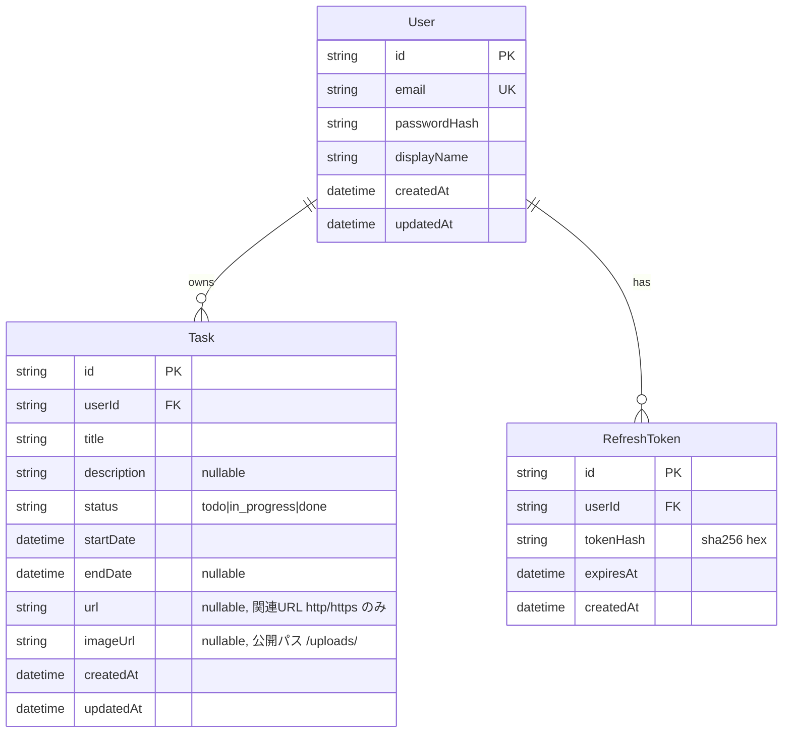

# データ仕様書

データモデル・DB スキーマ・データフローを定義する。実装は `apps/backend-layered` の TypeORM エンティティ。

## 目次

- [データモデル](#データモデル)
- [ER 図](#er-図)
- [DB スキーマ](#db-スキーマ)
- [データフロー](#データフロー)

## データモデル

| エンティティ | 説明 |
|---|---|
| User | ユーザー（認証主体） |
| Task | タスク。User に紐づく |
| RefreshToken | リフレッシュトークンのハッシュ（ローテーション管理） |

## ER 図

## DB スキーマ

- 本番: MySQL 8.4（`mysql2` ドライバ）。
- ローカル/テスト: better-sqlite3（インメモリ）。`DB_TYPE` 環境変数で切替。
- カラム型は MySQL / SQLite 双方で動くポータブルな型のみ（`varchar` / `text` / `datetime`）。`status` は enum カラムではなく `varchar` + 契約型 `TaskStatus` + DTO バリデーションで担保。
- タスクの期間は `startDate`（必須・日付のみ午前0時 UTC）/ `endDate`（任意・nullable）で表す。両方ある場合は `startDate ≤ endDate` を Validator / ドメインで担保（違反は 422）。
- **保存する instant を一意に決める**ため、受理する日付表現を RFC 3339 の 2 形式に絞る（`isRfc3339`）。
  - `full-date`（`2026-06-15`）→ **UTC 0 時**として解釈する。
  - `date-time`（`2026-06-15T00:00:00.000Z` / `2026-06-15T09:00:00+09:00`）→ **オフセット必須**。
  - オフセットなしの日時（`2026-01-01T12:30:00`・区切りが空白の `2026-01-01 12:30`）は **422**。`new Date()` が実行環境のローカル時刻として解釈するため、受理すると**同じリクエストがホストのタイムゾーン次第で別の instant として保存される**（開発機 Asia/Tokyo とコンテナ UTC で 9 時間ずれる）。
  - 実在しない日（`2026-02-30` / 平年の `2026-02-29` / `2026-04-31`）も **422**。`Date.parse` は月の長さを検査せず翌月へ繰り上げるため、受理すると**利用者の指定とは別の日**が保存される。判定は `Date.UTC` で組み立てた値を読み戻して一致を見る往復検査で行う（うるう年もこれだけで正しく扱える）。
- タスクの関連 URL（任意）は `url`（`varchar(2048)` nullable）に保持する。`http`/`https` スキームのみ許可し、検証は zod スキーマの `refine(isHttpUrl)` で担保する（`javascript:` 等は 422 で拒否）。
- タスクの添付画像（1枚・任意）は `imageUrl`（`varchar(512)` nullable）に**公開パス**（例: `/uploads/<file>`）のみを保持する。画像バイト列は DB に置かず、backend のファイルシステム（compose では volume）に保存し `/uploads` で静的配信する。
- **`users.email` の一意制約が「同じメールのユーザーは 2 人いない」の唯一の保証**。アプリ側の事前確認（`findByEmail` → `INSERT`）は check-then-act で、確認と INSERT の間に他の要求が同じ行を作れてしまうため、原子性は DB 制約だけが持つ。制約違反は infrastructure 層で業務エラー（409）へ翻訳し、それ以外の DB エラーは翻訳せず 500 のままにする。
- **API のメール上限（255 文字）は `users.email` の `varchar(255)` と同値**にする。API 側で弾かないと超過分が INSERT まで到達し、MySQL がカラム長エラーを返して 500 になる（SQLite は varchar 長を強制しないため e2e では気づけない）。契約（`packages/api-spec/main.tsp` の `@maxLength(255)`）・DTO・カラム長の 3 つを同じ値に保つ。
- **監査列（`createdAt` / `updatedAt`）は抽象ベースクラスに集約する**。3 版とも `AuditableEntity`（layered: `common/entities/`）/ `AuditableOrmEntity`（clean / onion: `shared/infrastructure/entities/`）を `extends` し、値の生成は TypeORM の `@CreateDateColumn` / `@UpdateDateColumn` に委ねる（アプリケーションコードで代入しない）。ベースクラスに `@Entity()` は付けないため独自テーブルにはならず、継承先のテーブルに列として展開される（**上の ER 図・スキーマは不変**）。
- `refresh_tokens` は**意図的に継承しない**。ローテーションは UPDATE ではなく DELETE + INSERT で行を置き換えるため `updatedAt` は常に `createdAt` と同値になり、継承させると情報を持たない列が増えるだけになる（`createdAt` のみを持つ）。
- 学習用途のスキーマ同期: ローカル/テスト（SQLite）は常に `synchronize: true`。MySQL は `DB_SYNCHRONIZE` 環境変数で制御し、既定は `false`（compose では `true`）。本番はマイグレーション運用に切替える想定。

## データフロー

- 登録/ログイン → User 作成・参照、RefreshToken 発行（ハッシュ保存）。
- タスク操作 → 認可（`userId` 一致）の上で Task を CRUD。
