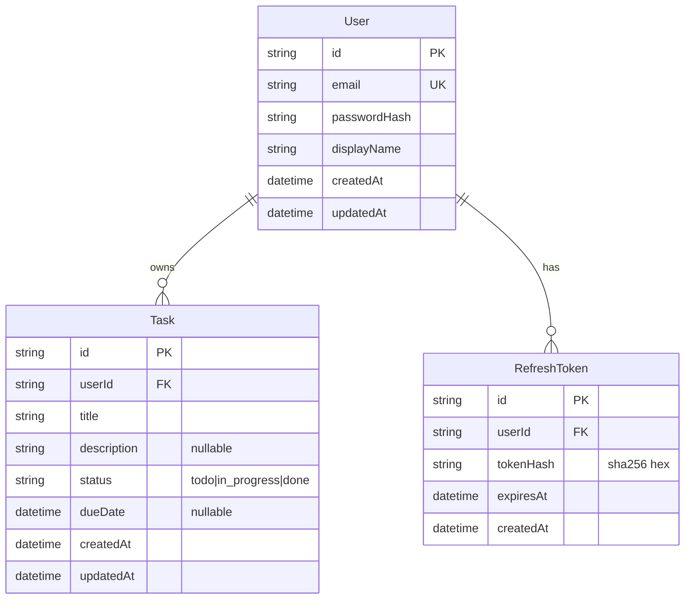

# データ仕様書

データモデル・DB スキーマ・データフローを定義する。実装は `apps/backend` の TypeORM エンティティ。

## データモデル

| エンティティ | 説明 |
|---|---|
| User | ユーザー（認証主体） |
| Task | タスク。User に紐づく |
| RefreshToken | リフレッシュトークンのハッシュ（ローテーション管理） |

## ER 図

## DB スキーマ

- 本番: MySQL 8.4（`mysql2` ドライバ）。
- ローカル/テスト: better-sqlite3（インメモリ）。`DB_TYPE` 環境変数で切替。
- カラム型は MySQL / SQLite 双方で動くポータブルな型のみ（`varchar` / `text` / `datetime`）。`status` は enum カラムではなく `varchar` + 契約型 `TaskStatus` + DTO バリデーションで担保。
- 学習用途では `synchronize: true`。本番はマイグレーション運用に切替える想定。

## データフロー

- 登録/ログイン → User 作成・参照、RefreshToken 発行（ハッシュ保存）。
- タスク操作 → 認可（`userId` 一致）の上で Task を CRUD。
