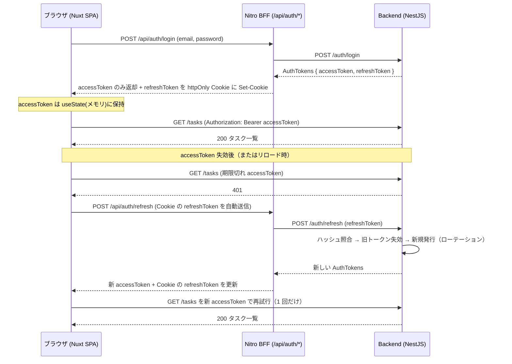

# セキュリティ仕様書

認証・認可・トークン・脆弱性対策を定義する。

## 目次

- [認証](#認証)
- [トークンの保管](#トークンの保管)
- [認可](#認可)
- [パスワード / トークンのハッシュ](#パスワード--トークンのハッシュ)
- [脆弱性対策](#脆弱性対策)
- [ファイルアップロード（タスク添付画像）](#ファイルアップロードタスク添付画像)
- [関連 URL（リンクプレビュー）](#関連-urlリンクプレビュー)
- [機密情報の管理](#機密情報の管理)

## 認証

- **JWT（access + refresh）** + Passport (`passport-jwt`)。
- アクセストークン: 短命（既定 900s）。`Authorization: Bearer` で送信。
- リフレッシュトークン: 長命（既定 7d）。**ローテーション**（使用時に旧トークン行を削除し再発行）。
- **401 を受けたら 1 回だけリフレッシュして再試行する**（`composables/useAuthedFetch.ts`。SPA / SSR 共通）。
  - 期限切れのたびに利用者へリロードを強いないため。再試行は 1 回だけで、その結果が再び 401 なら本当に権限が無いと判断して呼び出し側へ返す。
  - **同時に 401 になった複数リクエストは 1 本のリフレッシュを共有する**（in-flight を共有）。並行してリフレッシュするとローテーションと競合し、後発が消費済みトークンで失敗するため。
  - 共有する in-flight は `nuxtApp`（SSR ではリクエスト単位）をキーに持つ。モジュール変数にすると SSR で他利用者のリフレッシュ結果を共有してしまう。
  - リフレッシュに失敗したら**メモリのトークンと httpOnly Cookie の両方を破棄**し、`/login` へ戻す。Cookie を残すと次のリロードで無効なトークンによる復元を試み続けることになる。

## トークンの保管

- フロント: **アクセストークンはメモリ（`useState`）のみ**。localStorage には置かない。
- **リフレッシュトークンは httpOnly Cookie**（Nitro BFF が管理）。JS から読めずリロード後はサイレント更新で復元。

### 業務データを載せる Cookie（`frontend-ssr` の確認画面）

SSR 確認画面はタスクの入力内容（draft）を Cookie `task_draft` に保持する。トークン以外で Cookie に業務データを置く唯一の箇所のため、方針を明記する。

- 属性は refresh Cookie と同じく `httpOnly` / `sameSite: 'lax'` / `path: '/'` / 本番は `secure`。**JS から読めない**ため XSS で直接抜かれない。
- **有効期限 30 分**。入力途中の業務データを長期間ブラウザに残さない。タスク作成完了時は `DELETE /api/tasks/draft` で明示的に破棄する。
- 保持するのは title / description / status / 日付 / URL のみ。**認証情報・秘密値は入れない**。画像（File）も入れない（クライアント state で保持）。
- 復元時は zod スキーマ（`taskDraftSchema`）で検証し、壊れた値・契約外の `status` は draft なしとして扱う（改竄された Cookie をそのまま画面へ流さない）。
- サイズ上限はクライアント（入力中の警告）とサーバ（413）の両方で判定する。クライアント側の検証は迂回できるため、サーバ側を最終防御として必ず残す。
- BFF はクライアントから受け取った Bearer を backend へ**中継するだけで保存しない**。

### 業務データを載せる sessionStorage（`frontend-spa` の確認画面）

CSR 確認画面は同じ draft を **sessionStorage** に保持する。Cookie 版と比べた性質差を明記する。

- **JS から読める**。XSS を踏むと入力内容が読み出される（httpOnly Cookie にはできない攻撃）。トークン類を置かない方針は Cookie 版と同じで、ここに載せるのは title / description / status / 日付 / URL のみ。
- サーバへ送信されない。ネットワーク経路やサーバログに入力途中の内容が乗らない点は Cookie 版より有利。
- **タブ単位**でスコープされ、タブを閉じれば消える。Cookie 版のような明示的な有効期限は持たない。
- タスク作成完了時は `clear()` で明示的に破棄する（次の新規作成に残さない）。
- 読み出し時は zod（`utils/taskDraftSchema.ts`）で検証する。JS から書き換え可能なため、壊れた JSON・契約外の `status` は draft なしとして扱う。

**ログイン〜リフレッシュのシーケンス**（access はメモリ、refresh は BFF の httpOnly Cookie に隔離される）:

> リフレッシュに失敗した場合は再試行せず、セッション破棄（メモリ + Cookie）→ `/login` へ戻す。

## 認可

- タスクは所有者のみ操作可。`TasksService.findOwned` で存在=404 / 非所有=403 を区別。

## パスワード / トークンのハッシュ

- パスワード: **bcrypt**（コスト 12）。DTO で **8 文字以上・UTF-8 72 バイト以内**に制限する（登録・ログインの両方）。
  - 上限が**バイト**なのは bcrypt が 72 バイトを超えた分を**静かに切り捨てる**ため。文字数（`.max(72)`）で見ると「あ」24 文字＝72 バイトで登録したユーザーが、25 文字目を足した**別のパスワードでもログインできてしまう**（`bcrypt.compare` が先頭 72 バイトしか見ない）。
  - **ログイン側にも同じ上限を課す**のが要点。登録だけ絞ってもログインが無制限なら、上の抜け道は塞がらない。
  - 判定は `isWithinUtf8Bytes`（`Buffer.byteLength(value, 'utf8')`）。JSON Schema はバイト長を表現できないため、契約の `@maxLength(72)` は粗い上限にすぎず、実際の判定はサーバ側が担う。
- リフレッシュトークン: **SHA-256**（全体をハッシュ）+ `timingSafeEqual` で定数時間比較。
  - bcrypt は 72 バイトで切り捨てるため、JWT のような長い高エントロピー値には不適（テストで実バグとして検出・修正済み）。
  - 各リフレッシュトークンに `jti`(ランダム UUID) を付与し、同一秒・同一 payload でも一意化。

## 脆弱性対策

- 入力検証: **zod** スキーマ + ルート単位 `ZodValidationPipe`（`.strict()` で未知キー拒否＝旧 `forbidNonWhitelisted` 相当）。全 backend 版で統一。
- 例外は `AllExceptionsFilter` で契約 `ApiError` 形へ統一（内部情報を漏らさない）。
- ログイン失敗はユーザー有無を区別しない（列挙防止）。

## ファイルアップロード（タスク添付画像）

- **検証**: 2 段構えにする。
  - **受信段階**: `MulterModule` の `limits.fileSize`（設定 `MAX_UPLOAD_BYTES` 由来）で上限超過を止める。超過は **413**。ここで止めることで、巨大な multipart を**メモリに載せる前**に切れる（認証済みクライアントによるメモリ消費を防ぐ）。
  - **ハンドラ手前**: `ImageFilePipe`（DI で `ConfigService` を注入）が MIME（`image/png` / `image/jpeg` / `image/webp`）と欠落を確認し、違反は **422**（`errors[].field` は `file`）。サイズも再確認する（多層防御。`limits` が外れた場合の最後の砦）。申告 MIME で判定する（マジックナンバー検査は無効化）。
  - 上限・許可 MIME は**設定から読む**（ハードコードしない）。デコレータ評価時には `ConfigService` が使えないため、`ParseFilePipeBuilder` ではなく DI 可能な Pipe クラスにしている。
- **保存ファイル名はサーバ生成**（`<taskId>-<uuid>.<ext>`）。クライアント由来のファイル名は使わないため、パストラバーサルや既存ファイル上書きを構造的に防ぐ。
- **削除時**も保存パスの `basename` のみを保存ディレクトリに結合して `unlink` するため、保存先ディレクトリ外を参照しない。
- **認可**: 添付・削除は所有者のみ（存在=404 / 非所有=403、本体 CRUD と同じ `findOwned`）。
- 配信は静的（`/uploads`）。`imageUrl` には公開パスのみを保持し、ホスト名等は含めない。

## 関連 URL（リンクプレビュー）

タスクの `url` を確認画面・詳細で「安全なリンクカード」として表示する。外部コンテンツは一切読み込まない（iframe / 画像 / サーバ fetch なし）ため、SSRF・クリックジャッキング・任意描画のリスクは構造的に発生しない。多層防御で URL を扱う:

- **孤立ファイルを残さない**: タスク削除時に添付画像の実体も削除する（DB → ストレージの順）。片方だけ失敗する場合は「参照されない孤立ファイルが残る」側に倒す。逆順（ストレージ先）だと DB 削除の失敗で `imageUrl` が実体の無いパスを指し続ける。ストレージ削除の失敗は本処理を巻き戻さない（掃除の失敗で削除自体を失敗させない）。
- **スキーム allowlist**: `http`/`https` のみ許可。バックエンドは zod スキーマの `refine(isHttpUrl)`（`common/validation/zod-helpers.ts`）で検証し、`javascript:` / `data:` / `file:` 等は **422** で拒否。長さは 2048 文字まで。
- **フロント入力検証**: `TaskForm` が `isSafeHttpUrl()`（`new URL()` + protocol allowlist）で検証し、不正スキームは submit させない。
- **描画時ガード（最重要）**: Vue は `:href` を `javascript:` に対してサニタイズしない。`UrlPreview` は `isSafeHttpUrl()` を通った値のときだけ `<a>` を描画し、それ以外はリンクを出さず「無効な URL」表示にする（DB を直接改竄された等で不正値が残っても安全）。
- **リンク属性**: `target="_blank"` には `rel="noopener noreferrer"` を必須付与し、タブナビング（`window.opener` 乗っ取り）と Referer 漏洩を防ぐ。

## 機密情報の管理

- シークレットは環境変数（`.env`、`.gitignore` で除外）。`.env.example` をテンプレートとして提供する（**値は空**にしてあり、そのままでは起動しない）。
- **JWT 秘密鍵はコードに既定値を持たない。** `config/configuration.ts` が起動時に検証し、次のいずれかなら**起動に失敗する**（3 版共通）。
  - 未設定・空文字
  - このリポジトリに載っている既知のサンプル値（`dev-*` / `change-me-*`）
  - 32 文字未満（HS256 の出力が 32 バイトのため、鍵がそれより短いと鍵空間自体が探索の的になる）
  - `JWT_ACCESS_SECRET` と `JWT_REFRESH_SECRET` が同一
- 既定値へのフォールバックを置かないのは、**値があれば起動してしまうと設定漏れに気づけない**ため。落とせば設定漏れがデプロイの失敗として即座に現れる。
- **access と refresh に同じ鍵を使わせない**理由: `JwtAccessStrategy` は access secret での署名検証だけを行い、トークン種別のクレームを見ていない。同一鍵だと **7 日有効のリフレッシュトークンが 15 分のアクセストークンとして通る**。
- compose も既定値を持たない（`${JWT_ACCESS_SECRET:-}`）。未設定なら空のまま渡り、backend が起動時に落とす。compose 側で `:?`（必須変数）にしないのは、compose が**起動対象を選ぶ前にファイル全体を補間する**ため、MySQL しか起動しない `pnpm db:up` / IT / シナリオまで失敗するから。
