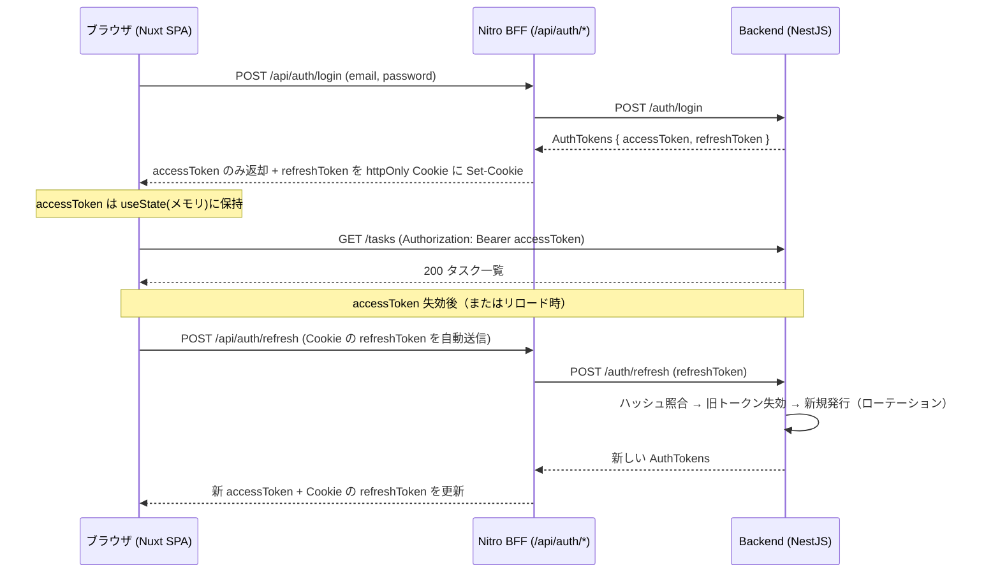

# セキュリティ仕様書

認証・認可・トークン・脆弱性対策を定義する。

## 目次

- [認証](#認証)
- [トークンの保管](#トークンの保管)
- [認可](#認可)
- [パスワード / トークンのハッシュ](#パスワード--トークンのハッシュ)
- [脆弱性対策](#脆弱性対策)
- [ファイルアップロード（タスク添付画像）](#ファイルアップロードタスク添付画像)
- [関連 URL（リンクプレビュー）](#関連-urlリンクプレビュー)
- [機密情報の管理](#機密情報の管理)

## 認証

- **JWT（access + refresh）** + Passport (`passport-jwt`)。
- アクセストークン: 短命（既定 900s）。`Authorization: Bearer` で送信。
- リフレッシュトークン: 長命（既定 7d）。**ローテーション**（使用時に旧トークン行を削除し再発行）。

## トークンの保管

- フロント: **アクセストークンはメモリ（`useState`）のみ**。localStorage には置かない。
- **リフレッシュトークンは httpOnly Cookie**（Nitro BFF が管理）。JS から読めずリロード後はサイレント更新で復元。

### 業務データを載せる Cookie（`frontend-ssr` の確認画面）

SSR 確認画面はタスクの入力内容（draft）を Cookie `task_draft` に保持する。トークン以外で Cookie に業務データを置く唯一の箇所のため、方針を明記する。

- 属性は refresh Cookie と同じく `httpOnly` / `sameSite: 'lax'` / `path: '/'` / 本番は `secure`。**JS から読めない**ため XSS で直接抜かれない。
- **有効期限 30 分**。入力途中の業務データを長期間ブラウザに残さない。タスク作成完了時は `DELETE /api/tasks/draft` で明示的に破棄する。
- 保持するのは title / description / status / 日付 / URL のみ。**認証情報・秘密値は入れない**。画像（File）も入れない（クライアント state で保持）。
- 復元時は zod スキーマ（`taskDraftSchema`）で検証し、壊れた値・契約外の `status` は draft なしとして扱う（改竄された Cookie をそのまま画面へ流さない）。
- サイズ上限はクライアント（入力中の警告）とサーバ（413）の両方で判定する。クライアント側の検証は迂回できるため、サーバ側を最終防御として必ず残す。
- BFF はクライアントから受け取った Bearer を backend へ**中継するだけで保存しない**。

**ログイン〜リフレッシュのシーケンス**（access はメモリ、refresh は BFF の httpOnly Cookie に隔離される）:

## 認可

- タスクは所有者のみ操作可。`TasksService.findOwned` で存在=404 / 非所有=403 を区別。

## パスワード / トークンのハッシュ

- パスワード: **bcrypt**（コスト 12）。DTO で 8〜72 文字に制限（bcrypt の 72 バイト制約に整合）。
- リフレッシュトークン: **SHA-256**（全体をハッシュ）+ `timingSafeEqual` で定数時間比較。
  - bcrypt は 72 バイトで切り捨てるため、JWT のような長い高エントロピー値には不適（テストで実バグとして検出・修正済み）。
  - 各リフレッシュトークンに `jti`(ランダム UUID) を付与し、同一秒・同一 payload でも一意化。

## 脆弱性対策

- 入力検証: **zod** スキーマ + ルート単位 `ZodValidationPipe`（`.strict()` で未知キー拒否＝旧 `forbidNonWhitelisted` 相当）。全 backend 版で統一。
- 例外は `AllExceptionsFilter` で契約 `ApiError` 形へ統一（内部情報を漏らさない）。
- ログイン失敗はユーザー有無を区別しない（列挙防止）。

## ファイルアップロード（タスク添付画像）

- **検証**: `ParseFilePipe` で MIME（`image/png` / `image/jpeg` / `image/webp`）とサイズ（≤ 2MB）を確認し、違反は **400**。申告 MIME で判定する（マジックナンバー検査は無効化）。
- **保存ファイル名はサーバ生成**（`<taskId>-<uuid>.<ext>`）。クライアント由来のファイル名は使わないため、パストラバーサルや既存ファイル上書きを構造的に防ぐ。
- **削除時**も保存パスの `basename` のみを保存ディレクトリに結合して `unlink` するため、保存先ディレクトリ外を参照しない。
- **認可**: 添付・削除は所有者のみ（存在=404 / 非所有=403、本体 CRUD と同じ `findOwned`）。
- 配信は静的（`/uploads`）。`imageUrl` には公開パスのみを保持し、ホスト名等は含めない。

## 関連 URL（リンクプレビュー）

タスクの `url` を確認画面・詳細で「安全なリンクカード」として表示する。外部コンテンツは一切読み込まない（iframe / 画像 / サーバ fetch なし）ため、SSRF・クリックジャッキング・任意描画のリスクは構造的に発生しない。多層防御で URL を扱う:

- **スキーム allowlist**: `http`/`https` のみ許可。バックエンドは zod スキーマの `refine(isHttpUrl)`（`common/validation/zod-helpers.ts`）で検証し、`javascript:` / `data:` / `file:` 等は **400** で拒否。長さは 2048 文字まで。
- **フロント入力検証**: `TaskForm` が `isSafeHttpUrl()`（`new URL()` + protocol allowlist）で検証し、不正スキームは submit させない。
- **描画時ガード（最重要）**: Vue は `:href` を `javascript:` に対してサニタイズしない。`UrlPreview` は `isSafeHttpUrl()` を通った値のときだけ `<a>` を描画し、それ以外はリンクを出さず「無効な URL」表示にする（DB を直接改竄された等で不正値が残っても安全）。
- **リンク属性**: `target="_blank"` には `rel="noopener noreferrer"` を必須付与し、タブナビング（`window.opener` 乗っ取り）と Referer 漏洩を防ぐ。

## 機密情報の管理

- シークレットは環境変数（`.env`、`.gitignore` で除外）。`.env.example` をテンプレートとして提供。
