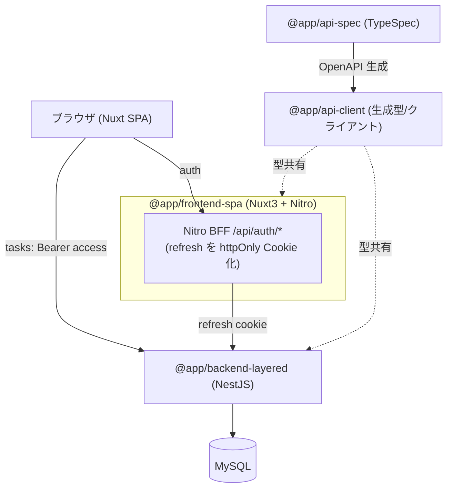

# アーキテクチャ仕様書

システム構成・技術スタック・インフラ・デプロイを定義する。

## 目次

- [システム構成](#システム構成)
- [技術スタック](#技術スタック)
- [バックエンドのアーキ構成（layered / clean）](#バックエンドのアーキ構成layered--clean)
- [添付画像の保存・配信](#添付画像の保存配信)
- [デプロイ](#デプロイ)
- [起動・生成コマンド](#起動生成コマンド)


## システム構成



## 技術スタック

| 領域 | 採用 |
|---|---|
| モノレポ | pnpm workspaces（`apps/*` + `packages/*`） |
| FE | Nuxt 3 (SPA, TS) / TailwindCSS / Nitro / Composable |
| BE | NestJS (TS) / TypeORM / レイヤード / MySQL(mysql2) |
| 契約 | TypeSpec → OpenAPI 3.1 → openapi-typescript + openapi-fetch |
| 認証 | JWT(access+refresh) / Passport / bcrypt |
| テスト | Jest / supertest / Vitest / MSW / Vue Test Utils / Playwright |
| インフラ | Docker（各アプリに Dockerfile）+ docker-compose |

## バックエンドのアーキ構成（layered / clean）

アーキテクチャ比較用に複数のバックエンド実装を持つ。**いずれも同一の API 契約（`@app/api-client`）を実装**し、同じ e2e シナリオが両方で通る（外から見た挙動は同一・内部構造のみ異なる）。

| | `apps/backend-layered` | `apps/backend-clean` |
|---|---|---|
| tasks の依存方向 | UseCase → TypeORM Repository（直接） | UseCase → **Port(interface)** ← TypeORM 実装（依存性逆転） |
| ドメイン | TypeORM Entity を直接利用 | フレームワーク非依存の `domain/Task` ＋ ORM Entity を分離 |
| 業務エラー | `NotFoundException` 等 Nest 例外を直接 throw | `DomainError`（kind）を throw → フィルタが HTTP へ翻訳 |
| 画像保存 | UseCase が fs を直接呼ぶ（`task.util.ts`） | `ImageStorage` Port ← `LocalImageStorage` 実装 |
| auth / users | 従来レイヤード | （当面）layered と同一構成 |

### backend-layered — auth / users（従来レイヤード）

- presentation: Controller / DTO
- application: Service（ユースケース・認可・トークン回転）
- infrastructure: Entity / TypeORM Repository

層はファイルの役割（`*.controller.ts` / `*.service.ts` / `*.entity.ts`）で区別する。

### backend-layered — tasks（レイヤード + UseCase・フォルダ分離）

presentation → application → infrastructure の素直な依存。太い Service を「1 操作 = 1 UseCase」に分解し、
フォルダで層を分離する。依存性逆転（ポート）はしない＝ UseCase が TypeORM Repository を直接利用する。

```
modules/tasks/
├ presentation/
│  ├ tasks.controller.ts   # HTTP 入口・DTO 受け・UseCase へ委譲
│  └ dto/                  # class-validator の DTO（契約型を implements）
├ application/
│  ├ usecases/             # 1 ルート = 1 ユースケース（list/create/get/update/delete/validate*/image*）
│  └ task.util.ts          # 認可(findOwnedTask)・日付検証・契約変換・画像 I/O の共有ヘルパー
└ infrastructure/
   └ task.entity.ts        # TypeORM Entity
```

- UseCase は `@InjectRepository(TaskEntity)` で Repository を直接注入し、`NotFoundException` / `ForbiddenException` / `BadRequestException` を直接投げる（グローバルの `AllExceptionsFilter` が `ApiError` 化）。
- 認可（存在=404 / 非所有=403）・開始≤終了・Entity→契約変換は `task.util.ts` に集約して各 UseCase から再利用する。
- DI は `tasks.module.ts` で UseCase 群を providers に列挙するのみ（ポート束ねは不要）。

> auth / users は従来レイヤード（Service 集約）のまま。tasks は同じレイヤードに UseCase を足してフォルダ分離した形。

### backend-clean — tasks（クリーンアーキテクチャ・Port で依存性逆転）

layered と同じ tasks を、**依存性逆転**で再構成したもの。application 層は Port（interface）にのみ依存し、TypeORM/fs を知らない。Port の実体は infrastructure 層が提供し、`tasks.module.ts` で束ねる。

```
modules/tasks/
├ domain/                       # 最内層・フレームワーク非依存
│  ├ task.ts                    #   ドメインエンティティ（認可・日付不変条件・画像付け外し）
│  └ task.errors.ts             #   DomainError（kind: not_found/forbidden/invalid）
├ application/
│  ├ ports/
│  │  ├ task-repository.port.ts #   TaskRepository（Port）+ DI トークン
│  │  └ image-storage.port.ts   #   ImageStorage（Port）+ DI トークン
│  ├ usecases/                  #   1 ルート = 1 UseCase。@Inject(TASK_REPOSITORY) で Port に依存
│  ├ task-access.ts             #   loadOwnedTask（存在/所有チェックの共有）
│  └ task.mapper.ts             #   domain Task → 契約 Task
├ infrastructure/
│  ├ task.orm-entity.ts         #   TypeORM Entity（永続化の詳細）
│  ├ task.mapper.ts             #   ORM ⇔ domain 変換
│  ├ typeorm-task.repository.ts #   TaskRepository の TypeORM 実装
│  └ local-image-storage.ts     #   ImageStorage のローカル FS 実装
└ presentation/
   ├ tasks.controller.ts        #   HTTP 入口（Multer file → ImageFile に詰め替え）
   └ dto/                       #   class-validator の DTO（契約型を implements）
```

- UseCase は `@Inject(TASK_REPOSITORY)` / `@Inject(IMAGE_STORAGE)` で **Port にのみ依存**し、TypeORM・fs を import しない。
- 業務エラーは `DomainError`（HTTP 非依存）で投げ、`AllExceptionsFilter` が `kind` を見て 404/403/400 と `ApiError` 形へ翻訳する。
- DI は `tasks.module.ts` で `{ provide: TASK_REPOSITORY, useClass: TypeOrmTaskRepository }` 等として Port ↔ 実装を束ねる（依存性逆転の要）。
- auth / users は layered と同一構成のまま（機能パリティ優先・clean 化は段階対応）。

## 添付画像の保存・配信

- backend が multipart で受け取り、`UPLOAD_DIR`（既定 `uploads`＝backend 作業ディレクトリ相対。compose では `/repo/apps/backend-layered/uploads` に上書き）にサーバ生成名で保存。`useStaticAssets`（platform-express 組み込み）で `/uploads` プレフィックス配信する。
- DB（`Task.imageUrl`）には公開パスのみ保持し、実体はファイルシステムに置く。
- compose では named volume（`uploads-data`）を `/repo/apps/backend-layered/uploads` にマウントし、コンテナ再作成でも画像を永続化する（別途のオブジェクトストレージコンテナは使わない）。
- e2e は外部依存を避けるため OS 一時ディレクトリに保存先を隔離する。

## デプロイ

- `docker compose up --build` で mysql + backend + frontend を起動。
- 環境変数は `.env`（`.env.example` 参照）。

## 起動・生成コマンド

```bash
pnpm install
pnpm api:gen            # 契約から型生成
pnpm db:up              # MySQL 起動(compose)
docker compose up --build
```
