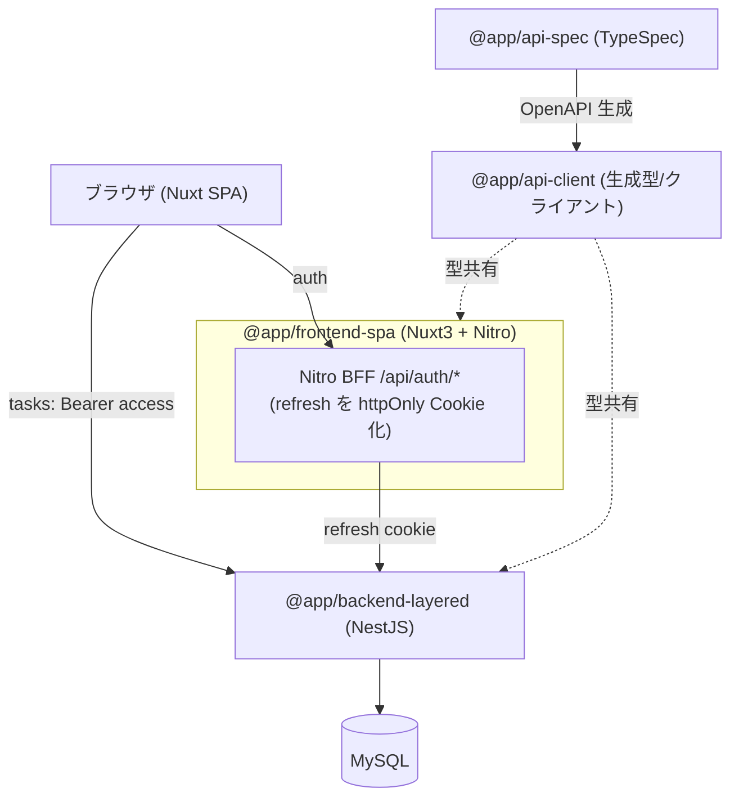

# アーキテクチャ仕様書

システム構成・技術スタック・インフラ・デプロイを定義する。

## 目次

- [システム構成](#システム構成)
- [技術スタック](#技術スタック)
- [バックエンドのアーキ構成（layered / clean）](#バックエンドのアーキ構成layered--clean)
- [フロントエンドのレンダリング方式（SPA / SSR）](#フロントエンドのレンダリング方式spa--ssr)
- [アーキテクチャ選定指針（トレードオフ）](#アーキテクチャ選定指針トレードオフ)
- [添付画像の保存・配信](#添付画像の保存配信)
- [デプロイ](#デプロイ)
- [起動・生成コマンド](#起動生成コマンド)


## システム構成



## 技術スタック

| 領域 | 採用 |
|---|---|
| モノレポ | pnpm workspaces（`apps/*` + `packages/*`） |
| FE | Nuxt 3 (SPA, TS) / TailwindCSS / Nitro / Composable |
| BE | NestJS (TS) / TypeORM / レイヤード / MySQL(mysql2) |
| 契約 | TypeSpec → OpenAPI 3.1 → openapi-typescript + openapi-fetch |
| 認証 | JWT(access+refresh) / Passport / bcrypt |
| テスト | Jest / supertest / Vitest / MSW / Vue Test Utils / Playwright |
| インフラ | Docker（各アプリに Dockerfile）+ docker-compose |

## バックエンドのアーキ構成（layered / clean）

アーキテクチャ比較用に複数のバックエンド実装を持つ。**いずれも同一の API 契約（`@app/api-client`）を実装**し、同じ e2e シナリオが両方で通る（外から見た挙動は同一・内部構造のみ異なる）。

| | `apps/backend-layered` | `apps/backend-clean` | `apps/backend-onion` |
|---|---|---|---|
| tasks の依存方向 | UseCase → TypeORM Repository（直接） | UseCase → **Port(interface)** ← TypeORM 実装（依存性逆転） | clean と同じ（依存は内向き） |
| 入力検証ライブラリ | **zod**（`presentation/dto/` のスキーマ + ルート単位 `ZodValidationPipe`。グローバル `ValidationPipe` は不使用） | **zod**（同左） | **zod**（同左） |
| 契約(interface)の所在 | （なし） | `application/ports/` | **`domain/`（中核が契約を所有）** |
| 読み取り分離（CQRS） | （なし・list/get も UseCase） | **list/get を `query-services/` + 読み取り専用 `TaskQuery` に分離**（戻りは `read-models/`） | clean と同じだが `queries/`（契約は `domain/`） |
| ドメインサービス | （なし） | `application/services/task-access.ts`（関数） | **`domain/services/TaskAccessService`（DI サービス）** |
| ドメイン | TypeORM Entity を直接利用 | framework 非依存の `domain/Task` ＋ ORM 分離 | clean と同じ |
| 業務エラー | Nest 例外を直接 throw | `DomainError`（kind）→ フィルタが HTTP 翻訳 | clean と同じ |
| 画像保存 | UseCase が fs を直接呼ぶ | `ImageStorage` Port ← FS 実装 | clean と同じ（契約は `domain/services/`） |
| auth / users | 従来レイヤード | **クリーン化済み**（usecase 分解＋ Port: UserRepository/PasswordHasher/TokenIssuer/RefreshTokenRepository） | **クリーン化済み**（clean と同じ分解。契約は domain が所有） |
| 業務エラーの分類 | Nest 例外 | `DomainError` に **conflict(409)/unauthorized(401) を追加**し auth も DomainError 化 | clean と同じ（tasks/auth とも DomainError・conflict/unauthorized 追加済み） |

### backend-layered — auth / users（従来レイヤード）

- presentation: Controller / DTO
- application: Service（ユースケース・認可・トークン回転）
- infrastructure: Entity / TypeORM Repository

層はファイルの役割（`*.controller.ts` / `*.service.ts` / `*.entity.ts`）で区別する。

### backend-layered — tasks（レイヤード + UseCase・フォルダ分離）

presentation → application → infrastructure の素直な依存。太い Service を「1 操作 = 1 UseCase」に分解し、
フォルダで層を分離する。依存性逆転（ポート）はしない＝ UseCase が TypeORM Repository を直接利用する。

```
modules/tasks/
├ presentation/
│  ├ tasks.controller.ts   # HTTP 入口・DTO 受け・UseCase へ委譲
│  └ dto/                  # zod スキーマ（.strict() + satisfies z.ZodType<契約型>）+ ルート単位 ZodValidationPipe
├ application/
│  ├ usecases/             # 1 ルート = 1 ユースケース（list/create/get/update/delete/image*）
│  └ task.util.ts          # 認可(findOwnedTask)・日付検証・契約変換・画像 I/O の共有ヘルパー
└ infrastructure/
   └ task.entity.ts        # TypeORM Entity
```

- UseCase は `@InjectRepository(TaskEntity)` で Repository を直接注入し、`NotFoundException` / `ForbiddenException` / `BadRequestException` を直接投げる（グローバルの `AllExceptionsFilter` が `ApiError` 化）。
- 認可（存在=404 / 非所有=403）・開始≤終了・Entity→契約変換は `task.util.ts` に集約して各 UseCase から再利用する。
- DI は `tasks.module.ts` で UseCase 群を providers に列挙するのみ（ポート束ねは不要）。

> auth / users は従来レイヤード（Service 集約）のまま。tasks は同じレイヤードに UseCase を足してフォルダ分離した形。

### 層内のフォルダ分割（clean / onion 共通の house 規約）

層（`presentation` / `application` / `domain` / `infrastructure`）を切ったら、**その中も役割別サブフォルダまで分ける**。層ディレクトリ直下にファイルを裸で置かない（`*.module.ts` / `*.types.ts` のみ層の外＝feature 直下）。`*.spec.ts` は対象ファイルと同じサブフォルダに置く。

| 層 | サブフォルダ |
|---|---|
| `presentation/` | `controllers/` `dto/` `guards/` `decorators/` `strategies/` |
| `application/` | `usecases/` `validators/` `mappers/` `services/` `inputs/`（＋ clean のみ `ports/` `read-models/` `query-services/`、onion は読み取りが `queries/`） |
| `domain/` | `entities/` `value-objects/` `errors/`（＋ onion のみ契約所有の `repositories/` `services/`） |
| `infrastructure/` | `repositories/` `services/` `entities/`（ORM Entity）`mappers/` |

- **狙いは契約と実装の対称性**。`domain/repositories/task.repository.ts`（契約）↔ `infrastructure/repositories/typeorm-task.repository.ts`（実装）、`domain/services/image-storage.ts` ↔ `infrastructure/services/local-image-storage.ts` のように、**どの実装がどの契約を満たすかをフォルダ位置だけで辿れる**。barrel を置かず相対 import で繋ぐ本リポジトリでは、この対称性が依存方向の可読性を直接支える（clean では契約が `application/ports/` にあるため、対称の相手は application 側になる）。
- **空フォルダは作らない**（未使用の概念フォルダは置かない）が、**実ファイルが 1 個でもサブフォルダは作る**。置き場所の判断を毎回発生させないことを、ファイル 1 個のフォルダのコストより優先する。置かないフォルダの一覧と理由は下記「採用しない概念」を参照。
- **layered は対象外**。tasks のみ層分離し、auth / users は従来レイヤード（Controller/Service/Entity を役割で区別）のまま維持する ──「層分割の有無」自体が 3 版の比較軸であるため。
- **ファイル名から feature 名を落とす（層分割とは別で、3 版すべてに適用）**。feature フォルダ配下で操作ごとに分かれるファイル（usecase / validator / query / dto / input）は `create.usecase.ts` `update.validator.ts` `set-image.usecase.ts` のように feature 名を持たない。パス（`tasks/application/usecases/`）が既に feature を示すため。一方 `task.mapper.ts` / `task-access.ts` / `task.repository.ts` / `task.orm-entity.ts` のように**エンティティそのものを指すファイルは feature 名を残す**（落とすと `mapper.ts` となり対象がパスから消える）。`tasks.module.ts` / `tasks.controller.ts` は NestJS 慣習どおり。**クラス名は据え置き**（`create.validator.ts` → `CreateTaskValidator`）。

### backend-clean — tasks（クリーンアーキテクチャ・Port で依存性逆転）

layered と同じ tasks を、**依存性逆転**で再構成したもの。application 層は Port（interface）にのみ依存し、TypeORM/fs を知らない。Port の実体は infrastructure 層が提供し、`tasks.module.ts` で束ねる。

> ディレクトリ配置: clean は機能スライス（feature slice）として **`src/api/{tasks,auth,users}/`** に置く（layered / onion は `src/modules/` のまま）。下記ツリーのルート `api/tasks/` はこれを指す。

> `src/shared/` は feature 名・feature 固有の型・Port を知らない共通基盤のためだけに使う。Task / Auth / User 固有のエラー・業務ルール・DTO・Port・Entity・Repository 実装は、再利用されても各 `api/{feature}/` に置く。

```
api/tasks/                         # src/api/tasks（機能スライス）
├ domain/                          # 最内層・フレームワーク非依存
│  ├ entities/
│  │  └ task.ts                    #   ドメインエンティティ（認可・日付不変条件・画像付け外し）
│  └ errors/
│     └ task.errors.ts             #   DomainError（kind: not_found/forbidden/invalid）
├ application/
│  ├ ports/
│  │  ├ task-repository.port.ts    #   TaskRepository（Port・書き込み）+ DI トークン
│  │  ├ task-query.port.ts         #   TaskQuery（Port・読み取り専用）+ DI トークン ★CQRS
│  │  └ image-storage.port.ts      #   ImageStorage（Port）+ DI トークン
│  ├ inputs/                       #   ★ユースケース入力（Command 型）+ 契約→Input 変換。presentation 非依存化の要
│  │  ├ create.input.ts       #     CreateTaskInput + toCreateTaskInput(userId, TaskCreate)
│  │  └ update.input.ts       #     UpdateTaskInput + toUpdateTaskInput(userId, id, TaskUpdate)
│  ├ read-models/                  #   ★読み取り表現（Read Model）。Query 側が返す型を application が所有
│  │  └ task.read-model.ts         #     TaskReadModel（= 契約 Task）/ TaskReadModelWithOwner
│  ├ usecases/                     #   書き込み（create/update/delete/image）。@Inject(TASK_REPOSITORY)・引数は Input
│  ├ query-services/               #   ★読み取り（list/get）。@Inject(TASK_QUERY) ★CQRS の Query 側（旧 queries/）
│  ├ validators/                   #   ★業務ルール検証（保存しない）。UseCase が注入して呼ぶ唯一の検証実体
│  ├ services/
│  │  └ task-access.ts             #   loadOwnedTask（存在/所有チェックの共有・書き込み用）
│  └ mappers/
│     └ task.mapper.ts             #   domain Task → 契約 Task
├ infrastructure/                  # ★domain / application の契約と同じ語彙で対称に配置
│  ├ entities/
│  │  └ task.orm-entity.ts         #   TypeORM Entity（永続化の詳細）
│  ├ mappers/
│  │  └ task.mapper.ts             #   ORM ⇔ domain 変換
│  ├ repositories/
│  │  ├ typeorm-task.repository.ts #   TaskRepository の TypeORM 実装（書き込み）
│  │  └ typeorm-task.query.ts      #   TaskQuery の TypeORM 実装（ORM 行 → Read Model 直射影）★CQRS
│  └ services/
│     └ local-image-storage.ts     #   ImageStorage のローカル FS 実装
└ presentation/
   ├ controllers/
   │  └ tasks.controller.ts        #   HTTP 入口（DTO→Input 変換・Multer file → ImageFile に詰め替え）
   ├ dto/                          #   zod スキーマ（.strict() + satisfies z.ZodType<契約型>）
   └ guards/
      └ jwt-auth.guard.ts          #   auth 所有の JwtAuthGuard を再エクスポート（tasks 文脈の窓口）

shared/                            # feature 非依存の共通基盤
├ domain/errors/domain-error.ts     #   DomainError の基底 + 共通 kind
├ presentation/
│  ├ filters/http-exception.filter.ts # DomainError / HttpException → ApiError
│  └ pipes/zod-validation.pipe.ts     # DTO スキーマを実行する汎用 Pipe
└ validation/zod-helpers.ts         #   ISO 8601・http/https の形式検証
```

- UseCase は `@Inject(TASK_REPOSITORY)` / `@Inject(IMAGE_STORAGE)` で **Port にのみ依存**し、TypeORM・fs を import しない。
- **application は presentation を import しない**: UseCase/Validator は presentation の DTO ではなく application 所有の **Input（Command 型）** を受け取る。DTO → Input 変換（`toCreateTaskInput` 等）は契約型を入力に取るため application 側にあっても presentation に依存せず、Controller が境界で詰め替える（依存は常に内向き）。
- 業務エラーは `DomainError`（HTTP 非依存）で投げ、`AllExceptionsFilter` が `kind` を見て 404/403/422/409/401 と `ApiError` 形へ翻訳する。`DomainError.fields`（破れた不変条件が属するドメイン属性名）は `ApiError.errors` へ展開される。`endDate` のような名前はドメインエンティティ自身が持つ属性名であり、presentation の語彙ではないため、ここに置いても依存方向は内向きのまま保たれる。
- DI は `tasks.module.ts` で `{ provide: TASK_REPOSITORY, useClass: TypeOrmTaskRepository }` 等として Port ↔ 実装を束ねる（依存性逆転の要）。
- **読み取りは CQRS で分離**: list/get は `query-services/` の Query Service が読み取り専用 Port `TaskQuery` にのみ依存し、ドメイン `Task` を経由せず ORM 行 → **Read Model（`read-models/`）** を直射影する（[読み取り分離（CQRS-lite）](#読み取り分離cqrs-lite) を参照）。
- **業務ルール検証は `validators/` に集約**: `CreateTaskValidator` / `UpdateTaskValidator` が**唯一の検証実体**で、UseCase は Validator を注入して呼び、自前では検証しない（同じルールを 2 か所に書かないため）。
  - **Validator は検証済みのドメインオブジェクトを返す**（`CreateTaskValidator` → `NewTask`、`UpdateTaskValidator` → `Task`、`RegisterValidator` → `void`）。UseCase は受け取った実体をそのまま保存するだけでよく、`UpdateTaskValidator` では **SELECT が 1 回で済む**（`void` にすると検証時と保存時で別々に読むことになり、その間の他者更新で「検証した対象とは違う行を保存する」ことが起こりうる）。`RegisterValidator` は組み立てるものが無いため `void`。
  - ドメイン不変条件の実体は domain に残し（`Task.draft` / `applyUpdate`）、validators は「保存せず検証する」オーケストレーションのみを持つ。
- **`read-models` / `query-services` / `presentation/guards` は clean のみに導入**（layered=baseline）。**`inputs/` は clean / onion 両方**が持つ（依存を内向きに保つための境界変換なので、どちらのアーキでも要る）。**`validators/` は clean / onion 両方**が持つ（onion は読み取りが `queries/`）。`forms` / `models` / `schemas` / `resolves` / `interceptors` / `middlewares` は**意図的に置かない**（→ 次項「採用しない概念」）。

### domain の構成要素（Entity / Value Object / Domain Service）

`domain/` に置けるのは下記 3 種。判定軸は「不変かどうか」ではなく **同一性（identity）を持つか**と**置き場所があるか**（正本は [.claude/rules/stack-backend.md](../.claude/rules/stack-backend.md)）。

| 要素 | 判定基準 | 置き場所 | 例 |
|---|---|---|---|
| **Entity** | **同一性（id）を持ち**、時間とともに状態が変わる。等価性は id で決まる | `domain/entities/` | `Task` / `User` |
| **Value Object** | 同一性を持たず、**属性だけで等価**。**不変** | `domain/value-objects/` | `DateRange`（開始・終了の対） |
| **Domain Service** | Entity にも VO にも**自然な置き場所がない**操作（複数の集約にまたがる／契約越しの取得が要る） | onion=`domain/services/` / clean=`application/services/` | `TaskAccessService`（取得＋所有チェック） |

- **「VO 以外は Domain Service」ではない**。この切り分けを字義どおり適用すると Entity まで Domain Service になり、状態を持たない**貧血ドメイン**になる。Domain Service は**置き場所が無いときの最後の手段**で、既定の受け皿ではない。
- **VO の要件**: ①**不変**（`readonly`。変更は新インスタンス）②**同一性を持たない**（等価性は属性で決まる）③**不正な状態のインスタンスを作れない**（生成時に検証し、通ったあとは常に妥当）。③が要点で、「検証関数を呼び忘れる」経路そのものを型で消せる。
- **VO と zod の責務分担**: VO が担うのは **zod では表現しにくいフィールド間の関係**だけ（開始 ≤ 終了）。単一フィールドの長さ・形式・列挙は `presentation/dto/` の zod に残す。
- **導入例: `DateRange`（clean / onion）**: `TaskState` / `NewTask` が `startDate` / `endDate` の 2 フィールドではなく `period: DateRange` を持つ。
  - 以前は自由関数 `assertDateOrder(start, end)` を `Task.draft` / `applyUpdate` が**呼ぶことを覚えている**前提だった。VO 化により `DateRange` 型の値は常に「開始 ≤ 終了」を満たすため、**呼び忘れる経路が型として消えた**。
  - `applyUpdate` は**期間を先に組み立ててから**他フィールドを書き換える。以前は「書き換えてから検証」だったため、検証に失敗すると部分的に壊れた状態の Task が残っていた。
  - 不変性は getter が `Date` の複製を返すことで担保する。`readonly` だけでは `range.start.setFullYear(...)` を防げない（`Date` 自体が可変なため）。
  - **layered は VO 化しない**（比較軸の baseline。`task.util.ts` の `assertDateOrder` をそのまま残す）。HTTP 契約・e2e は 3 版で不変。
  - zod は `z.string().max(120)` のような単一フィールドの制約は得意だが、「開始 ≤ 終了」は `.refine()` でオブジェクト全体を見るしかなく、しかも PATCH では**既存値とマージした後**でないと判定できない。ここが zod の手の届かない領域で、VO の担当範囲になる。
  - 逆に長さや形式まで VO に持たせると、同じルールの入口が zod と VO の 2 つになり、片方だけ変えたときに気づけない（DryRun を廃止した理由と同じ形の問題）。

### 採用しない概念

「無いこと」自体が設計判断なので、迷ったときに再導入されないよう理由ごと残す（正本は [.claude/rules/stack-backend.md](../.claude/rules/stack-backend.md)）。

| 概念 | 置かない理由 |
|---|---|
| **`forms/`（Laravel の FormRequest 相当）** | FormRequest は `authorize()` と `rules()`（形式ルールと `unique:` 等の DB ルール）を 1 クラスに同居させるが、本リポジトリでは関心ごとに 3 か所へ分けている（下表）。**zod と Validator の「間」に FormRequest 相当の段があるのではなく、FormRequest 1 つが分解されている**。切り分けは「**HTTP でなくても成り立つ制約か**」で判断する |
| `models/` `schemas/` | 契約の真実は `packages/api-spec/main.tsp`（→ `@app/api-client`）にあり、別に型やスキーマの一覧を持つと二重管理になる |
| `resolves/` | GraphQL 専用の概念で、REST では出番がない |
| `interceptors/` `middlewares/` | 現状は `AllExceptionsFilter`（例外→`ApiError`）と `FileInterceptor`（multipart）で足りている。必要になった時点で作る |

FormRequest の責務がどこへ行ったか（`POST /tasks` の場合）:

| FormRequest の責務 | 本リポジトリでの担当 | 実行タイミング |
|---|---|---|
| `authorize()` | `presentation/guards/` の Guard ＋ 所有権チェック（`loadOwnedTask` / `TaskAccessService`） | ハンドラ本体の前 |
| `rules()` の形式部分（`required\|max:120`） | `presentation/dto/` の zod スキーマ ＋ `ZodValidationPipe`。422 と `ApiError.errors` の組み立てもここ | ハンドラ本体の前 |
| `rules()` の DB 部分（`unique:users`） | `application/validators/` の Validator（clean / onion） | ハンドラ本体の中 |

> 保存せず検証だけ行う DryRun エンドポイント（`*/validate`）は「FormRequest を単体で呼べるようにしたもの」に相当したが、同じルールの入口が二重になるため廃止した（フェーズ 24）。FormRequest が信頼できるのは「それを通らずハンドラへ入る経路が無い」ためで、各段の入口を 1 つに保つことで同じ性質を担保している。
- **入力検証は zod（全 backend 版）**: `presentation/dto/` を class-validator の DTO クラスではなく **zod スキーマ**にし、clean では `shared/presentation/pipes/ZodValidationPipe` をルート単位で適用する。グローバル `ValidationPipe` は使わない。`.strict()` が旧 `forbidNonWhitelisted`（未知キー拒否）を担い、`satisfies z.ZodType<契約型>` が旧 `implements 契約型`（契約ドリフトの型検出）を担う。検証失敗は presentation の関心事として `UnprocessableEntityException`（422）を投げ、`AllExceptionsFilter` が `ApiError` に翻訳する（DomainError は使わない＝形式検証は transport 層の関心）。400 ではなく 422 なのは、構文としては正しい JSON がフィールド単位で意味的に不正、という状態を指すため。当初は clean のみ zod だったが layered / onion へ横展開し 3 版とも zod に統一した（**同じ e2e 契約が 3 版すべてで通る**＝検証手法を差し替えても外形は不変）。
- auth / users も tasks と同じクリーン構成へ移行済み（[backend-clean — auth / users](#backend-clean--auth--users) を参照）。onion も同様にクリーン化済み（契約は domain 所有）。layered の auth / users のみ従来レイヤードのまま。

### backend-clean — auth / users（クリーンアーキテクチャ）

tasks と同じ思想（domain / application / infrastructure / presentation の分離＋ Port による依存性逆転）を auth / users にも適用したもの。**外部 I/O をすべて Port 化**し、ユースケースは bcrypt・JWT・TypeORM を知らない。

```
api/users/                          # HTTP 入口を持たない（presentation なし）。auth が利用する
├ domain/entities/user.ts           #   フレームワーク非依存の User（passwordHash は照合用に保持）
├ application/
│  ├ ports/user-repository.port.ts  #   UserRepository（findByEmail/findById/create）+ トークン
│  └ mappers/user.mapper.ts         #   domain User → 契約 User（passwordHash を構造的に落とす）
├ infrastructure/
│  ├ entities/user.orm-entity.ts    #   TypeORM Entity
│  ├ mappers/user.mapper.ts         #   ORM ⇔ domain 変換
│  └ repositories/typeorm-user.repository.ts
└ users.module.ts                   #   USER_REPOSITORY を provide & export（層の外＝feature 直下）

api/auth/
├ domain/errors/auth.errors.ts      #   EmailAlreadyRegistered(conflict)/InvalidCredentials/InvalidRefreshToken(unauthorized)
├ application/
│  ├ ports/                         #   PasswordHasher / TokenIssuer / RefreshTokenRepository（暗号・DB を抽象化）
│  ├ inputs/                        #   register/login（契約→Input）
│  ├ usecases/                      #   register / login / refresh / logout（1操作1ユースケース）
│  ├ validators/register.validator  #   業務ルール検証（メール重複）
│  └ services/issue-auth-tokens.ts  #   トークン発行＋保存の共有ヘルパー
├ infrastructure/                   # ★application/ports/ と対称
│  ├ entities/refresh-token.orm-entity.ts
│  ├ repositories/typeorm-refresh-token.repository.ts  # RefreshTokenRepository 実装
│  └ services/                      #   bcrypt-password-hasher / jwt-token-issuer
└ presentation/                     #   controllers/auth.controller / dto / guards / strategies（Passport は presentation）
```

- **暗号も Port 化（Full）**: `PasswordHasher`（bcrypt）/ `TokenIssuer`（JWT・secret・jti・exp 抽出を隠蔽）を Port にし、ユースケースは抽象的なトークン文字列だけを扱う。リフレッシュの SHA-256 ハッシュ・定数時間照合は `RefreshTokenRepository` 実装の内部に閉じる（application はハッシュ方式を知らない）。
- **業務エラーは DomainError に統一**: `DomainErrorKind` に `conflict`(409)/`unauthorized`(401) を追加し、auth も HTTP 非依存の `DomainError` を投げる（フィルタが翻訳）。これで tasks とエラーモデルが揃う。
- **テストの形が痩せる**: usecase 単体は 4 つの Port をモックするだけで分岐（重複・認可・回転）を検証でき、実 bcrypt/JWT は infrastructure の spec（`bcrypt-password-hasher` / `jwt-token-issuer`）で個別に検証する。
- HTTP 契約・e2e シナリオは layered と同一（外から見た挙動は不変）。

### backend-onion — tasks（オニオンアーキテクチャ・契約をドメイン中核が所有）

clean と同じ依存性逆転だが、**契約（interface）の所在**と**ドメインサービス**の扱いが異なる。オニオンでは依存が常に内向き（presentation → application → domain）で、ドメイン中核が自分の必要とする契約を定義する。

> `src/shared/` は feature 名・feature 固有の型・domain の契約を知らない共通基盤のためだけに使う。Task / Auth / User 固有のエラー・業務ルール・DTO・domain の Port / Service・Entity・Repository 実装は、再利用されても各 `modules/{feature}/` に置く。

```
modules/tasks/
├ domain/                             # 中核（最内）
│  ├ entities/task.ts                 #   エンティティ
│  ├ errors/task.errors.ts            #   DomainError
│  ├ repositories/
│  │  ├ task.repository.ts            #   TaskRepository interface + token（★契約を中核が所有・書き込み）
│  │  └ task-query.ts                 #   TaskQuery interface + token（★読み取り契約も中核が所有）★CQRS
│  └ services/
│     ├ image-storage.ts              #   ImageStorage interface + token（★ドメインが求める能力）
│     └ task-access.service.ts        #   TaskAccessService（★ドメインサービス: 取得+所有チェック・書き込み用）
├ application/
│  ├ inputs/                          #   ★ユースケース入力（Command 型）+ 契約→Input 変換。presentation 非依存化の要
│  ├ usecases/                        #   書き込み。domain の契約/サービスに依存
│  ├ queries/                         #   読み取り（list/get）。@Inject(TASK_QUERY) ★CQRS の Query 側
│  ├ validators/                      #   業務ルール検証（保存しない）。UseCase が注入して呼ぶ唯一の検証実体
│  └ mappers/task.mapper.ts           #   domain Task → 契約 Task
├ infrastructure/                     # ★domain の契約と同じ語彙で対称に配置
│  ├ entities/task.orm-entity.ts      #   TypeORM Entity
│  ├ mappers/task.mapper.ts           #   ORM ⇔ domain 変換
│  ├ repositories/                    #   domain/repositories/ の実装（TypeOrmTaskRepository / TypeOrmTaskQuery）
│  └ services/local-image-storage.ts  #   domain/services/ImageStorage の実装
└ presentation/
   ├ controllers/tasks.controller.ts
   └ dto/

shared/                               # feature / domain 契約に非依存の共通基盤
├ domain/errors/domain-error.ts        #   DomainError の基底 + 共通 kind
├ presentation/
│  ├ filters/http-exception.filter.ts  # DomainError / HttpException → ApiError
│  └ pipes/zod-validation.pipe.ts      # DTO スキーマを実行する汎用 Pipe
└ validation/zod-helpers.ts            #   ISO 8601・http/https の形式検証
```

- **application は presentation を import しない**: Controller が契約型 `TaskCreate` / `TaskUpdate` を `application/inputs/` の `toCreateTaskInput` / `toUpdateTaskInput` で Command 型に直してから UseCase を呼ぶ。変換関数が引数に取るのは DTO 型（`z.infer<typeof createTaskSchema>`）ではなく**契約型**で、契約型は `@app/api-client`（層の外の共有パッケージ）にあり presentation・application のどちらからも等距離のため、これを共通語彙にすると矢印が presentation → application の一方向に揃う。ISO 文字列 → `Date` の正規化もこの境界で済ませる。
- clean との差は **契約の置き場所**: clean は `application/ports/`、onion は `domain/`（中核が契約を所有）。読み取り契約 `TaskQuery` も同様に onion は `domain/repositories/` に置く。
- 所有チェックは `TaskAccessService`（DI 可能なドメインサービス）に集約し、各ユースケースが注入して再利用する（clean では application の関数 `loadOwnedTask`）。読み取り側（Query）は domain を経由しないため、`GetTaskQuery` 内で owner を比較して 404/403 を区別する。
- エンティティ・DomainError・例外フィルタは clean と同じ（tasks）。**auth / users も clean 同様にクリーン化済み**（fat `AuthService` を register/login/refresh/logout の 4 ユースケース＋ register validator に分解し、UserRepository / PasswordHasher / TokenIssuer / RefreshTokenRepository を Port 化。契約は onion 流に `domain/repositories/` `domain/services/` が所有）。layered のみ従来レイヤード。

### 読み取り分離（CQRS-lite）

clean / onion は tasks の **読み取り（list/get）を CQRS の Query 側として書き込みから分離**している（layered は分離せず baseline）。HTTP 契約・e2e シナリオは 3 版で完全に同一。

| | 書き込み（Command） | 読み取り（Query） |
|---|---|---|
| 対象ルート | POST/PATCH/DELETE・`*/image`（書き込み） | `GET /tasks`・`GET /tasks/{id}` |
| 配置 | `application/usecases/`（保存）/ clean・onion は `application/validators/`（業務ルール検証） | clean=`application/query-services/` / onion=`application/queries/` |
| 依存する契約 | `TaskRepository`（domain `Task` を返す） | `TaskQuery`（**Read Model を直接返す**・読み取り専用） |
| 契約の所在 | clean=`application/ports/` / onion=`domain/repositories/` | 同左（`task-query` として隣に置く） |
| 変換 | ORM → domain → 契約（2 段。不変条件を通す） | **ORM 行 → Read Model（1 段直射影）**。clean は `read-models/` の `TaskReadModel`、domain を作らない |
| 所有判定 | `loadOwnedTask` / `TaskAccessService`（domain `Task.assertOwnedBy`） | Query が owner を比較（`findByIdWithOwner` の戻り owner で 404/403 区別） |

- **狙い**: 参照に不要なドメインエンティティ生成・2 段マッピングを省き、読み取りを軽量化する。単体テストは read 専用 Port（`TaskQuery`）のみモックで済み、書き込み側 Repository を注入しない（依存が痩せる）。
- **404/403 の区別**: `where {id, userId}` で短絡すると他人のタスクが 404 になり契約に反するため、Query は **id だけで引いて owner を添えて返し**（`findByIdWithOwner`）、呼び出し側で 404（不存在）/ 403（非所有）を分ける。
- **トレードオフ**: 所有判定と ORM→契約マッピングが書き込み側と別実装になり 2 か所に分散する。tasks は read が 2 本・検索なしのため利益は限定的で、本リポジトリでは「CQRS-lite の形を 1 か所示す」学習目的の比較例として置く（production では検索/集計が育つ見込みで採否を判断）。

## フロントエンドのレンダリング方式（SPA / SSR）

レンダリング方式の比較用に 2 つの Nuxt 実装を持つ。**機能・画面・API 契約は同一**で、同じ E2E シナリオが両方で通る。
ただし**タスク新規作成の確認画面のみ、方式差を比較する目的で実装を分けている**（後述「確認画面の方式差」）。

| | `apps/frontend-spa` | `apps/frontend-ssr` |
|---|---|---|
| レンダリング | `ssr: false`（クライアントのみ） | `ssr: true`（初期 HTML をサーバ生成） |
| セッション復元 | クライアント（`plugins/auth-init.client.ts`）。初回ロード後に BFF `/api/auth/refresh` でメモリへ復元 | **サーバ**（`plugins/auth-init.ts`）。初期リクエストで httpOnly refresh Cookie を読み、backend `/auth/refresh` で復元 → `useState` に格納（SSR 描画＋ハイドレーション） |
| 入力/レスポンス検証 | **zod**（フォーム検証 `utils/taskFormSchema.ts` + レスポンスのランタイム検証 `utils/taskSchema.ts`） | **zod**（同左。URL 安全判定は `utils/safeUrl.ts` の `isSafeHttpUrl` を共有） |
| `/tasks` 直アクセス | クライアントで復元後にデータ取得 | **サーバで復元 → サーバで一覧描画**してから配信 |
| `useApiClient` の base | 常に公開 URL | SSR 時はサーバ用 `apiBaseUrl`、クライアント時は公開 URL |
| トークンの扱い | access はメモリ、refresh は httpOnly Cookie | 同左（SSR 復元時も refresh は httpOnly のまま。rotate 後の Cookie をサーバが Set-Cookie で返す） |
| タスク作成の確認画面 | 独立ルート `/tasks/new/confirm` を**クライアント描画**。draft は sessionStorage | 独立ルート `/tasks/new/confirm` を**サーバ描画**。draft は httpOnly Cookie |

### 確認画面の方式差（SSR / CSR）

同じ「入力 → 確認 → 確定」フローを、状態の置き場所を変えて実装し比較している。

両版とも `/tasks/new`（入力）→ `/tasks/new/confirm`（確認）の 2 ルート構成・画像はメモリ保持、と**揃えてある**。
差は「draft をどこに置くか」の一点に絞ってある。

| | `frontend-spa`（CSR） | `frontend-ssr`（SSR） |
|---|---|---|
| draft の保持 | **sessionStorage**（ブラウザ・タブ単位） | **httpOnly Cookie** `task_draft`（サーバ・30 分で失効） |
| 確認内容の描画 | ハイドレーション後にクライアントが描画 | **初回 HTML にサーバが埋め込む**（JS 不要で読める） |
| リロード | 確認内容が残る | 同左 |
| 別タブで確認画面を開く | **draft が無く入力画面へ戻る**（タブ単位のため） | **復元できる**（Cookie はタブ間で共有） |
| サイズ上限 | 実質なし（sessionStorage は約 5MB） | **3,500 バイト**（日本語 約 380 文字。下記の制約を参照） |
| XSS 耐性 | **JS から読める**（XSS で入力内容が漏れうる） | httpOnly のため JS から読めない |
| 画像プレビュー | `useState` の File を `createObjectURL`。**保存できないためリロードで消える** | 同左（`<ClientOnly>` で囲む） |

> **どちらが優れているかではなく、制約が入れ替わる**。Cookie 方式はサイズ上限と引き換えに XSS 耐性とタブ間共有を得て、sessionStorage 方式はサイズ自由と引き換えにその両方を失う。

**CSR 版の draft フロー**:

1. フォーム submit → `useTaskDraft().save()` が sessionStorage へ保存（画像は `useState` へ退避）。
3. `/tasks/new/confirm` へ遷移。ページは `load()` で同期的に復元して描画する（サーバは関与しない）。
4. 「作成する」→ `POST /tasks` → 画像があれば `POST /tasks/{id}/image` → `clear()` で draft 破棄 → 詳細へ。

> `load()` は zod（`utils/taskDraftSchema.ts`）で検証する。sessionStorage は JS から書き換えられるため、
> 壊れた JSON・契約外の `status` は draft なしとして扱い、不正な内容を確認画面へ流さない。

**SSR 版の draft フロー**:

1. フォーム submit → クライアントが `POST /api/tasks/draft`。
2. Nitro BFF が形式検証（`taskDraftSchema`）と Cookie 上限チェックを行い、draft を httpOnly Cookie に保存する（backend へは中継しない）。
3. `/tasks/new/confirm` へ遷移。ページは `useRequestFetch()` で `GET /api/tasks/draft` を**サーバ実行**し、確認内容を含む HTML を返す。
4. 「作成する」→ `POST /tasks` → 画像があれば `POST /tasks/{id}/image` → `DELETE /api/tasks/draft` で draft 破棄 → 詳細へ。

**設計上の制約（Cookie 直方式を選んだ結果）**:

- Cookie は 1 本あたり約 4KB で、超過分は**エラーにならず黙って破棄**される。BFF 側で 3,500 バイト（Cookie 名・属性のオーバーヘッド分を引いた安全マージン）を超えたら 413 を返して入力画面に留める。
- サイズ判定は **URL エンコード後**の長さで行う。日本語 1 文字は `%E3%81%82` の 9 文字へ膨らむため、生の JSON 長で測ると上限を大幅に超過する。
- 結果として、フォームが許可する説明 2,000 文字（`utils/taskFormSchema.ts`）に対し、**日本語では約 380 文字で Cookie 上限に到達する**。文字数では表現できない上限のため、判定を `utils/draftSize.ts` に集約し**クライアント（入力中の警告）とサーバ（413）で同じ基準**を使う。`TaskForm` は `payloadByteLimit` を渡された画面でのみこの検証を行う（Cookie を使わない編集フローでは無効）。413 は Cookie が黙って壊れるのを防ぐ最終防御として残す。
- 上限そのものを無くすには Nitro のサーバ側ストア + Cookie はセッション ID のみ、という方式へ移す必要がある（未着手候補）。
- SSR 実行中の取得には `$fetch` ではなく **`useRequestFetch()`** を使う。`$fetch` は元リクエストのヘッダを引き継がないため httpOnly Cookie が Nitro に届かず、draft を取得できない。

### SSR 版のセッション復元フロー（要点）

1. ブラウザが `/tasks` を直接リクエスト（httpOnly refresh Cookie 同送）。
2. Nuxt プラグイン（サーバ実行）が Cookie を読み、backend `/auth/refresh` でアクセストークン＋ユーザーを取得。
3. ローテーションされた新しい refresh トークンを Cookie に書き戻す（Set-Cookie）。
4. `useState` にアクセストークン／ユーザーを格納 → グローバルミドルウェアの認可判定とページの `useAsyncData('tasks')` がサーバ側で正しく動作 → 一覧を SSR 描画。
5. クライアントは同じ `useState`（ペイロード）でハイドレーション。再フェッチ不要。

> アクセストークンは設計上メモリ／JS 露出（短命）で、SSR 版では初期ペイロードにも載る。長命な refresh は SPA/SSR とも httpOnly Cookie に隔離する方針は共通。
> flatpickr 等のクライアント専用 DOM 操作は `onMounted`（クライアント）に閉じており、サーバは素の `<input>` を描画するためハイドレーション不整合は起きない。

## アーキテクチャ選定指針（トレードオフ）

本リポジトリは同一の API 契約に対して複数のアーキ実装を持つ「比較用」プロジェクト。以下は**どれをいつ選ぶか**の指針。前提として、3 つのバックエンドは**外から見た挙動が完全に同一**（同じ e2e が通る）であり、差は**内部の依存方向と契約の置き場所**だけにある。

### バックエンド: layered → clean → onion

| 観点 | layered | clean | onion |
|---|---|---|---|
| 依存方向 | UseCase が TypeORM に直接依存 | UseCase は Port に依存（実装は外側） | clean と同じ（依存は内向き） |
| 契約(interface)の所在 | なし | application 層（`application/ports/`） | ドメイン中核（`domain/`） |
| ドメインの独立性 | 低（ORM Entity = ドメイン） | 高（`domain/Task` を分離） | 高（clean と同等） |
| ファイル数・初期コスト | 小 | 中 | 中〜大 |
| DB/FW 差し替え耐性 | 低 | 高 | 高 |
| 学習・規約の重さ | 軽い | 中 | 重い（層・命名の規律） |

**選定の目安**:

- **layered**: CRUD 中心で**ドメインロジックが薄い**、寿命が短い、チームが小さい。最短で動かすならこれ。過剰な抽象化は読み手のコストになる。
- **clean**: ビジネスルールが育つ見込みがあり、**DB やフレームワークを差し替え可能にしたい / ユースケースを DB なしで単体テストしたい**。Port による依存性逆転の恩恵がコストを上回るとき。本リポジトリの tasks のように「所有・期間・画像」など実ルールがあるドメインの既定解。
- **onion**: clean の動機に加え、**ドメインが自分の必要とする契約を所有すべき**という設計規律をチームで徹底したいとき。`domain/` に repository/サービスの interface を集約することで「依存は常に内向き」を物理配置で強制できる。反面、clean との実利益差は小さく、規律維持コストが増える。**clean で足りるなら onion にしない**判断も妥当。

> 注意: clean と onion の差は本質的に小さい（契約の置き場所とドメインサービスの形式）。「正しさ」より**チームが一貫して守れる規律**を選ぶ方が価値が高い。

### フロントエンド: SPA vs SSR

| 観点 | SPA (`ssr:false`) | SSR (`ssr:true`) |
|---|---|---|
| 初期表示 | JS ロード後に描画 | サーバが HTML を返す（速い初期描画 / SEO 有利） |
| セッション復元 | クライアントで実行（シンプル） | **サーバで実行**（httpOnly Cookie から）。実装が増える |
| 認証の複雑さ | 低 | 中（Cookie 転送・ローテーション Cookie の Set-Cookie・ハイドレーション整合） |
| サーバ負荷・運用 | 静的配信に近い | リクエスト毎にサーバ描画（Node ランタイム必須） |

**選定の目安**:

- **SPA**: 管理画面・社内ツール・認証必須アプリなど、**SEO 不要で初期描画にシビアでない**もの。トークンをメモリに閉じる設計と相性がよく、認証フローが最も素直。
- **SSR**: **SEO / OGP / 初期表示速度が重要**な公開ページ。ただしメモリ保持トークン設計と組み合わせると、サーバ側セッション復元（Cookie 読取・ローテーション Cookie の返却・`useState` ハイドレーション）が必須になり、認証まわりの複雑さが増える。`frontend-ssr/plugins/auth-init.ts` がその実装例。

### 共通の学び

- **API 契約を 1 か所（TypeSpec）に固定**したことで、これだけ内部構造が違っても FE/BE が破綻せず差し替えられる。契約駆動が比較を成立させている土台。
- **テストの形はアーキを映す**: 依存性逆転すると単体テストはモックが減って意図が明確になり、責務を 1 か所へ集約すると（例: onion の `TaskAccessService`）テストもそこへ集約される。テストの重複・モックの多さは設計の臭いのシグナル。

## 添付画像の保存・配信

- backend が multipart で受け取り、`UPLOAD_DIR`（既定 `uploads`＝backend 作業ディレクトリ相対。compose では `/repo/apps/backend-layered/uploads` に上書き）にサーバ生成名で保存。`useStaticAssets`（platform-express 組み込み）で `/uploads` プレフィックス配信する。
- DB（`Task.imageUrl`）には公開パスのみ保持し、実体はファイルシステムに置く。
- compose では named volume（`uploads-data`）を `/repo/apps/backend-layered/uploads` にマウントし、コンテナ再作成でも画像を永続化する（別途のオブジェクトストレージコンテナは使わない）。
- e2e は外部依存を避けるため OS 一時ディレクトリに保存先を隔離する。

## デプロイ

- `docker compose up --build` で mysql + backend + frontend を起動。
- 環境変数は `.env`（`.env.example` 参照）。

## 起動・生成コマンド

```bash
pnpm install
pnpm api:gen            # 契約から型生成
pnpm db:up              # MySQL 起動(compose)
docker compose up --build
```
