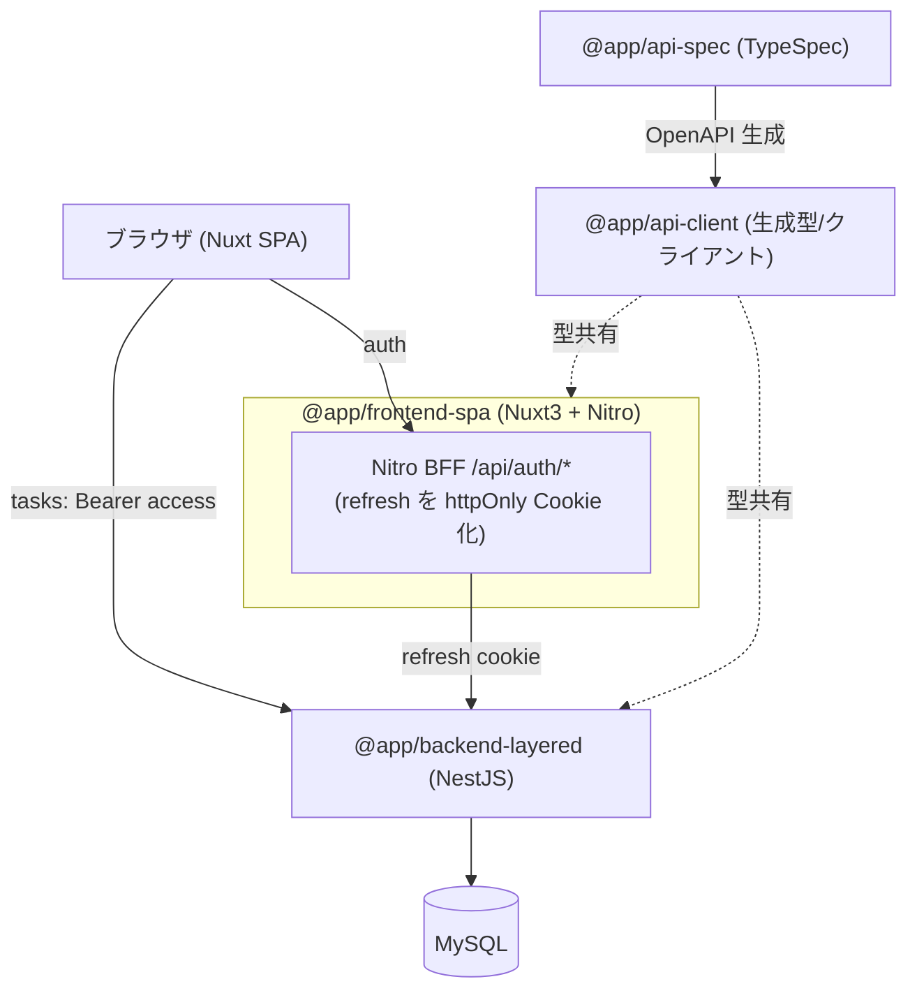

# アーキテクチャ仕様書

システム構成・技術スタック・インフラ・デプロイを定義する。

## 目次

- [システム構成](#システム構成)
- [技術スタック](#技術スタック)
- [レイヤード構成（backend）](#レイヤード構成backend)
- [添付画像の保存・配信](#添付画像の保存配信)
- [デプロイ](#デプロイ)
- [起動・生成コマンド](#起動生成コマンド)


## システム構成



## 技術スタック

| 領域 | 採用 |
|---|---|
| モノレポ | pnpm workspaces（`apps/*` + `packages/*`） |
| FE | Nuxt 3 (SPA, TS) / TailwindCSS / Nitro / Composable |
| BE | NestJS (TS) / TypeORM / レイヤード / MySQL(mysql2) |
| 契約 | TypeSpec → OpenAPI 3.1 → openapi-typescript + openapi-fetch |
| 認証 | JWT(access+refresh) / Passport / bcrypt |
| テスト | Jest / supertest / Vitest / MSW / Vue Test Utils / Playwright |
| インフラ | Docker（各アプリに Dockerfile）+ docker-compose |

## レイヤード構成（backend）

モジュールごとに 2 つの構成が混在する（学習目的の段階的移行）。

### auth / users（従来レイヤード）

- presentation: Controller / DTO
- application: Service（ユースケース・認可・トークン回転）
- infrastructure: Entity / TypeORM Repository

層はファイルの役割（`*.controller.ts` / `*.service.ts` / `*.entity.ts`）で区別する。

### tasks（レイヤード + UseCase・フォルダ分離）

presentation → application → infrastructure の素直な依存。太い Service を「1 操作 = 1 UseCase」に分解し、
フォルダで層を分離する。依存性逆転（ポート）はしない＝ UseCase が TypeORM Repository を直接利用する。

```
modules/tasks/
├ presentation/
│  ├ tasks.controller.ts   # HTTP 入口・DTO 受け・UseCase へ委譲
│  └ dto/                  # class-validator の DTO（契約型を implements）
├ application/
│  ├ usecases/             # 1 ルート = 1 ユースケース（list/create/get/update/delete/validate*/image*）
│  └ task.util.ts          # 認可(findOwnedTask)・日付検証・契約変換・画像 I/O の共有ヘルパー
└ infrastructure/
   └ task.entity.ts        # TypeORM Entity
```

- UseCase は `@InjectRepository(TaskEntity)` で Repository を直接注入し、`NotFoundException` / `ForbiddenException` / `BadRequestException` を直接投げる（グローバルの `AllExceptionsFilter` が `ApiError` 化）。
- 認可（存在=404 / 非所有=403）・開始≤終了・Entity→契約変換は `task.util.ts` に集約して各 UseCase から再利用する。
- DI は `tasks.module.ts` で UseCase 群を providers に列挙するのみ（ポート束ねは不要）。

> auth / users は従来レイヤード（Service 集約）のまま。tasks は同じレイヤードに UseCase を足してフォルダ分離した形。

## 添付画像の保存・配信

- backend が multipart で受け取り、`UPLOAD_DIR`（既定 `uploads`＝backend 作業ディレクトリ相対。compose では `/repo/apps/backend-layered/uploads` に上書き）にサーバ生成名で保存。`useStaticAssets`（platform-express 組み込み）で `/uploads` プレフィックス配信する。
- DB（`Task.imageUrl`）には公開パスのみ保持し、実体はファイルシステムに置く。
- compose では named volume（`uploads-data`）を `/repo/apps/backend-layered/uploads` にマウントし、コンテナ再作成でも画像を永続化する（別途のオブジェクトストレージコンテナは使わない）。
- e2e は外部依存を避けるため OS 一時ディレクトリに保存先を隔離する。

## デプロイ

- `docker compose up --build` で mysql + backend + frontend を起動。
- 環境変数は `.env`（`.env.example` 参照）。

## 起動・生成コマンド

```bash
pnpm install
pnpm api:gen            # 契約から型生成
pnpm db:up              # MySQL 起動(compose)
docker compose up --build
```
