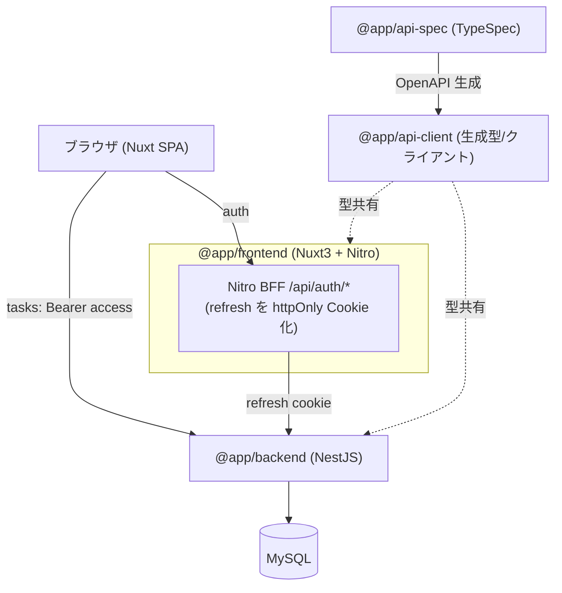

# アーキテクチャ仕様書

システム構成・技術スタック・インフラ・デプロイを定義する。

## 目次

- [システム構成](#システム構成)
- [技術スタック](#技術スタック)
- [レイヤード構成（backend）](#レイヤード構成backend)
- [添付画像の保存・配信](#添付画像の保存配信)
- [デプロイ](#デプロイ)
- [起動・生成コマンド](#起動生成コマンド)


## システム構成



## 技術スタック

| 領域 | 採用 |
|---|---|
| モノレポ | pnpm workspaces（`apps/*` + `packages/*`） |
| FE | Nuxt 3 (SPA, TS) / TailwindCSS / Nitro / Composable |
| BE | NestJS (TS) / TypeORM / レイヤード / MySQL(mysql2) |
| 契約 | TypeSpec → OpenAPI 3.1 → openapi-typescript + openapi-fetch |
| 認証 | JWT(access+refresh) / Passport / bcrypt |
| テスト | Jest / supertest / Vitest / MSW / Vue Test Utils / Playwright |
| インフラ | Docker（各アプリに Dockerfile）+ docker-compose |

## レイヤード構成（backend）

モジュールごとに 2 つの構成が混在する（学習目的の段階的移行）。

### auth / users（従来レイヤード）

- presentation: Controller / DTO
- application: Service（ユースケース・認可・トークン回転）
- infrastructure: Entity / TypeORM Repository

層はファイルの役割（`*.controller.ts` / `*.service.ts` / `*.entity.ts`）で区別する。

### tasks（クリーンアーキテクチャ / Onion・参考実装）

依存を内向き（presentation → application → domain、infrastructure → application）に固定し、
フォルダで層を分離する。Repository とファイル保存は **ポート（interface）** にして依存性を逆転する。

```
modules/tasks/
├ presentation/        Controller / DTO / DTO⇄ドメイン変換 / ドメインエラー→ApiError フィルタ
├ application/
│  ├ usecases/         1 ルート = 1 ユースケース（list/create/get/update/delete/validate*/image*）
│  └ ports/            TaskRepositoryPort・ImageStoragePort（DI トークン付き interface）
├ domain/              Task / TaskDraft（業務ルール）・DomainError（HTTP 非依存）
└ infrastructure/      TypeORM Entity / Repository 実装 / ローカル FS 保存 / mapper
```

- 同じデータが domain / ORM Entity / contract(`@app/api-client`) の 3 表現を持ち、変換は mapper に集約する。
- ドメインは NestJS/TypeORM を知らず、`DomainError` を投げる。HTTP への翻訳は presentation の `DomainExceptionFilter`。
- DI は `tasks.module.ts` で `{ provide: TASK_REPOSITORY, useClass: TypeormTaskRepository }` のように束ねる。

> auth/users も同じパターンへ横展開可能。tasks を先行移行した参考実装と位置づける。

## 添付画像の保存・配信

- backend が multipart で受け取り、`UPLOAD_DIR`（既定 `uploads`＝backend 作業ディレクトリ相対。compose では `/repo/apps/backend/uploads` に上書き）にサーバ生成名で保存。`useStaticAssets`（platform-express 組み込み）で `/uploads` プレフィックス配信する。
- DB（`Task.imageUrl`）には公開パスのみ保持し、実体はファイルシステムに置く。
- compose では named volume（`uploads-data`）を `/repo/apps/backend/uploads` にマウントし、コンテナ再作成でも画像を永続化する（別途のオブジェクトストレージコンテナは使わない）。
- e2e は外部依存を避けるため OS 一時ディレクトリに保存先を隔離する。

## デプロイ

- `docker compose up --build` で mysql + backend + frontend を起動。
- 環境変数は `.env`（`.env.example` 参照）。

## 起動・生成コマンド

```bash
pnpm install
pnpm api:gen            # 契約から型生成
pnpm db:up              # MySQL 起動(compose)
docker compose up --build
```
