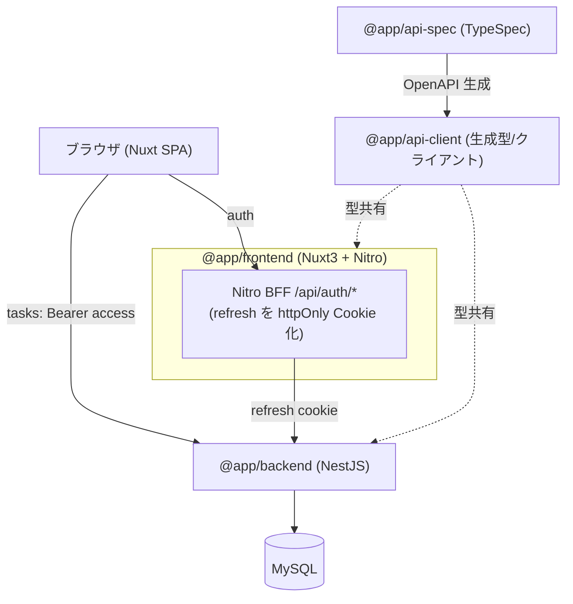

# アーキテクチャ仕様書

システム構成・技術スタック・インフラ・デプロイを定義する。

## システム構成



## 技術スタック

| 領域 | 採用 |
|---|---|
| モノレポ | pnpm workspaces（`apps/*` + `packages/*`） |
| FE | Nuxt 3 (SPA, TS) / TailwindCSS / Nitro / Composable |
| BE | NestJS (TS) / TypeORM / レイヤード / MySQL(mysql2) |
| 契約 | TypeSpec → OpenAPI 3.1 → openapi-typescript + openapi-fetch |
| 認証 | JWT(access+refresh) / Passport / bcrypt |
| テスト | Jest / supertest / Vitest / MSW / Vue Test Utils / Playwright |
| インフラ | Docker（各アプリに Dockerfile）+ docker-compose |

## レイヤード構成（backend）

- presentation: Controller / DTO
- application: Service（ユースケース・認可・トークン回転）
- infrastructure: Entity / TypeORM Repository

## 添付画像の保存・配信

- backend が multipart で受け取り、`UPLOAD_DIR`（既定 `apps/backend/uploads`）にサーバ生成名で保存。`useStaticAssets`（platform-express 組み込み）で `/uploads` プレフィックス配信する。
- DB（`Task.imageUrl`）には公開パスのみ保持し、実体はファイルシステムに置く。
- compose では named volume（`uploads-data`）を `/repo/apps/backend/uploads` にマウントし、コンテナ再作成でも画像を永続化する（別途のオブジェクトストレージコンテナは使わない）。
- e2e は外部依存を避けるため OS 一時ディレクトリに保存先を隔離する。

## デプロイ

- `docker compose up --build` で mysql + backend + frontend を起動。
- 環境変数は `.env`（`.env.example` 参照）。

## 起動・生成コマンド

```bash
pnpm install
pnpm api:gen            # 契約から型生成
pnpm db:up              # MySQL 起動(compose)
docker compose up --build
```
