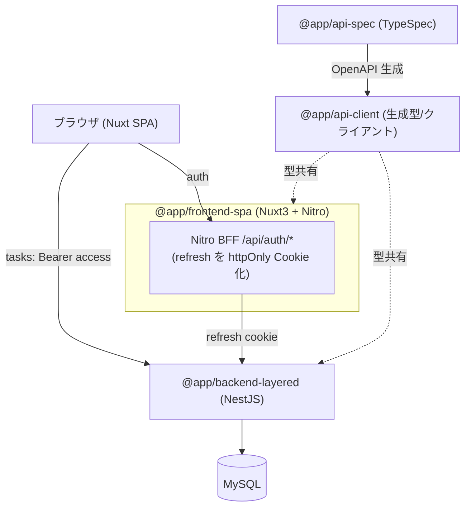

# アーキテクチャ仕様書

システム構成・技術スタック・インフラ・デプロイを定義する。

## 目次

- [システム構成](#システム構成)
- [技術スタック](#技術スタック)
- [バックエンドのアーキ構成（layered / clean）](#バックエンドのアーキ構成layered--clean)
- [フロントエンドのレンダリング方式（SPA / SSR）](#フロントエンドのレンダリング方式spa--ssr)
- [アーキテクチャ選定指針（トレードオフ）](#アーキテクチャ選定指針トレードオフ)
- [添付画像の保存・配信](#添付画像の保存配信)
- [デプロイ](#デプロイ)
- [起動・生成コマンド](#起動生成コマンド)


## システム構成



## 技術スタック

| 領域 | 採用 |
|---|---|
| モノレポ | pnpm workspaces（`apps/*` + `packages/*`） |
| FE | Nuxt 3 (SPA, TS) / TailwindCSS / Nitro / Composable |
| BE | NestJS (TS) / TypeORM / レイヤード / MySQL(mysql2) |
| 契約 | TypeSpec → OpenAPI 3.1 → openapi-typescript + openapi-fetch |
| 認証 | JWT(access+refresh) / Passport / bcrypt |
| テスト | Jest / supertest / Vitest / MSW / Vue Test Utils / Playwright |
| インフラ | Docker（各アプリに Dockerfile）+ docker-compose |

## バックエンドのアーキ構成（layered / clean）

アーキテクチャ比較用に複数のバックエンド実装を持つ。**いずれも同一の API 契約（`@app/api-client`）を実装**し、同じ e2e シナリオが両方で通る（外から見た挙動は同一・内部構造のみ異なる）。

| | `apps/backend-layered` | `apps/backend-clean` | `apps/backend-onion` |
|---|---|---|---|
| tasks の依存方向 | UseCase → TypeORM Repository（直接） | UseCase → **Port(interface)** ← TypeORM 実装（依存性逆転） | clean と同じ（依存は内向き） |
| 契約(interface)の所在 | （なし） | `application/ports/` | **`domain/`（中核が契約を所有）** |
| ドメインサービス | （なし） | `application/task-access.ts`（関数） | **`domain/services/TaskAccessService`（DI サービス）** |
| ドメイン | TypeORM Entity を直接利用 | framework 非依存の `domain/Task` ＋ ORM 分離 | clean と同じ |
| 業務エラー | Nest 例外を直接 throw | `DomainError`（kind）→ フィルタが HTTP 翻訳 | clean と同じ |
| 画像保存 | UseCase が fs を直接呼ぶ | `ImageStorage` Port ← FS 実装 | clean と同じ（契約は `domain/services/`） |
| auth / users | 従来レイヤード | （当面）layered と同一構成 | （当面）layered と同一構成 |

### backend-layered — auth / users（従来レイヤード）

- presentation: Controller / DTO
- application: Service（ユースケース・認可・トークン回転）
- infrastructure: Entity / TypeORM Repository

層はファイルの役割（`*.controller.ts` / `*.service.ts` / `*.entity.ts`）で区別する。

### backend-layered — tasks（レイヤード + UseCase・フォルダ分離）

presentation → application → infrastructure の素直な依存。太い Service を「1 操作 = 1 UseCase」に分解し、
フォルダで層を分離する。依存性逆転（ポート）はしない＝ UseCase が TypeORM Repository を直接利用する。

```
modules/tasks/
├ presentation/
│  ├ tasks.controller.ts   # HTTP 入口・DTO 受け・UseCase へ委譲
│  └ dto/                  # class-validator の DTO（契約型を implements）
├ application/
│  ├ usecases/             # 1 ルート = 1 ユースケース（list/create/get/update/delete/validate*/image*）
│  └ task.util.ts          # 認可(findOwnedTask)・日付検証・契約変換・画像 I/O の共有ヘルパー
└ infrastructure/
   └ task.entity.ts        # TypeORM Entity
```

- UseCase は `@InjectRepository(TaskEntity)` で Repository を直接注入し、`NotFoundException` / `ForbiddenException` / `BadRequestException` を直接投げる（グローバルの `AllExceptionsFilter` が `ApiError` 化）。
- 認可（存在=404 / 非所有=403）・開始≤終了・Entity→契約変換は `task.util.ts` に集約して各 UseCase から再利用する。
- DI は `tasks.module.ts` で UseCase 群を providers に列挙するのみ（ポート束ねは不要）。

> auth / users は従来レイヤード（Service 集約）のまま。tasks は同じレイヤードに UseCase を足してフォルダ分離した形。

### backend-clean — tasks（クリーンアーキテクチャ・Port で依存性逆転）

layered と同じ tasks を、**依存性逆転**で再構成したもの。application 層は Port（interface）にのみ依存し、TypeORM/fs を知らない。Port の実体は infrastructure 層が提供し、`tasks.module.ts` で束ねる。

```
modules/tasks/
├ domain/                       # 最内層・フレームワーク非依存
│  ├ task.ts                    #   ドメインエンティティ（認可・日付不変条件・画像付け外し）
│  └ task.errors.ts             #   DomainError（kind: not_found/forbidden/invalid）
├ application/
│  ├ ports/
│  │  ├ task-repository.port.ts #   TaskRepository（Port）+ DI トークン
│  │  └ image-storage.port.ts   #   ImageStorage（Port）+ DI トークン
│  ├ usecases/                  #   1 ルート = 1 UseCase。@Inject(TASK_REPOSITORY) で Port に依存
│  ├ task-access.ts             #   loadOwnedTask（存在/所有チェックの共有）
│  └ task.mapper.ts             #   domain Task → 契約 Task
├ infrastructure/
│  ├ task.orm-entity.ts         #   TypeORM Entity（永続化の詳細）
│  ├ task.mapper.ts             #   ORM ⇔ domain 変換
│  ├ typeorm-task.repository.ts #   TaskRepository の TypeORM 実装
│  └ local-image-storage.ts     #   ImageStorage のローカル FS 実装
└ presentation/
   ├ tasks.controller.ts        #   HTTP 入口（Multer file → ImageFile に詰め替え）
   └ dto/                       #   class-validator の DTO（契約型を implements）
```

- UseCase は `@Inject(TASK_REPOSITORY)` / `@Inject(IMAGE_STORAGE)` で **Port にのみ依存**し、TypeORM・fs を import しない。
- 業務エラーは `DomainError`（HTTP 非依存）で投げ、`AllExceptionsFilter` が `kind` を見て 404/403/400 と `ApiError` 形へ翻訳する。
- DI は `tasks.module.ts` で `{ provide: TASK_REPOSITORY, useClass: TypeOrmTaskRepository }` 等として Port ↔ 実装を束ねる（依存性逆転の要）。
- auth / users は layered と同一構成のまま（機能パリティ優先・clean 化は段階対応）。

### backend-onion — tasks（オニオンアーキテクチャ・契約をドメイン中核が所有）

clean と同じ依存性逆転だが、**契約（interface）の所在**と**ドメインサービス**の扱いが異なる。オニオンでは依存が常に内向き（presentation → application → domain）で、ドメイン中核が自分の必要とする契約を定義する。

```
modules/tasks/
├ domain/                          # 中核（最内）
│  ├ task.ts / task.errors.ts      #   エンティティ + DomainError
│  ├ repositories/
│  │  └ task.repository.ts         #   TaskRepository interface + token（★契約を中核が所有）
│  └ services/
│     ├ image-storage.ts           #   ImageStorage interface + token（★ドメインが求める能力）
│     └ task-access.service.ts     #   TaskAccessService（★ドメインサービス: 取得+所有チェック）
├ application/usecases/            # アプリケーションサービス。domain の契約/サービスに依存
├ infrastructure/                 # domain の契約を実装（TypeOrmTaskRepository / LocalImageStorage）
└ presentation/                   # Controller / DTO
```

- clean との差は **契約の置き場所**: clean は `application/ports/`、onion は `domain/`（中核が契約を所有）。
- 所有チェックは `TaskAccessService`（DI 可能なドメインサービス）に集約し、各ユースケースが注入して再利用する（clean では application の関数 `loadOwnedTask`）。
- エンティティ・DomainError・例外フィルタ・auth/users は clean と同じ。

## フロントエンドのレンダリング方式（SPA / SSR）

レンダリング方式の比較用に 2 つの Nuxt 実装を持つ。**機能・画面・API 契約は同一**で、同じ E2E シナリオが両方で通る。

| | `apps/frontend-spa` | `apps/frontend-ssr` |
|---|---|---|
| レンダリング | `ssr: false`（クライアントのみ） | `ssr: true`（初期 HTML をサーバ生成） |
| セッション復元 | クライアント（`plugins/auth-init.client.ts`）。初回ロード後に BFF `/api/auth/refresh` でメモリへ復元 | **サーバ**（`plugins/auth-init.ts`）。初期リクエストで httpOnly refresh Cookie を読み、backend `/auth/refresh` で復元 → `useState` に格納（SSR 描画＋ハイドレーション） |
| `/tasks` 直アクセス | クライアントで復元後にデータ取得 | **サーバで復元 → サーバで一覧描画**してから配信 |
| `useApiClient` の base | 常に公開 URL | SSR 時はサーバ用 `apiBaseUrl`、クライアント時は公開 URL |
| トークンの扱い | access はメモリ、refresh は httpOnly Cookie | 同左（SSR 復元時も refresh は httpOnly のまま。rotate 後の Cookie をサーバが Set-Cookie で返す） |

### SSR 版のセッション復元フロー（要点）

1. ブラウザが `/tasks` を直接リクエスト（httpOnly refresh Cookie 同送）。
2. Nuxt プラグイン（サーバ実行）が Cookie を読み、backend `/auth/refresh` でアクセストークン＋ユーザーを取得。
3. ローテーションされた新しい refresh トークンを Cookie に書き戻す（Set-Cookie）。
4. `useState` にアクセストークン／ユーザーを格納 → グローバルミドルウェアの認可判定とページの `useAsyncData('tasks')` がサーバ側で正しく動作 → 一覧を SSR 描画。
5. クライアントは同じ `useState`（ペイロード）でハイドレーション。再フェッチ不要。

> アクセストークンは設計上メモリ／JS 露出（短命）で、SSR 版では初期ペイロードにも載る。長命な refresh は SPA/SSR とも httpOnly Cookie に隔離する方針は共通。
> flatpickr 等のクライアント専用 DOM 操作は `onMounted`（クライアント）に閉じており、サーバは素の `<input>` を描画するためハイドレーション不整合は起きない。

## アーキテクチャ選定指針（トレードオフ）

本リポジトリは同一の API 契約に対して複数のアーキ実装を持つ「比較用」プロジェクト。以下は**どれをいつ選ぶか**の指針。前提として、3 つのバックエンドは**外から見た挙動が完全に同一**（同じ e2e が通る）であり、差は**内部の依存方向と契約の置き場所**だけにある。

### バックエンド: layered → clean → onion

| 観点 | layered | clean | onion |
|---|---|---|---|
| 依存方向 | UseCase が TypeORM に直接依存 | UseCase は Port に依存（実装は外側） | clean と同じ（依存は内向き） |
| 契約(interface)の所在 | なし | application 層（`application/ports/`） | ドメイン中核（`domain/`） |
| ドメインの独立性 | 低（ORM Entity = ドメイン） | 高（`domain/Task` を分離） | 高（clean と同等） |
| ファイル数・初期コスト | 小 | 中 | 中〜大 |
| DB/FW 差し替え耐性 | 低 | 高 | 高 |
| 学習・規約の重さ | 軽い | 中 | 重い（層・命名の規律） |

**選定の目安**:

- **layered**: CRUD 中心で**ドメインロジックが薄い**、寿命が短い、チームが小さい。最短で動かすならこれ。過剰な抽象化は読み手のコストになる。
- **clean**: ビジネスルールが育つ見込みがあり、**DB やフレームワークを差し替え可能にしたい / ユースケースを DB なしで単体テストしたい**。Port による依存性逆転の恩恵がコストを上回るとき。本リポジトリの tasks のように「所有・期間・画像」など実ルールがあるドメインの既定解。
- **onion**: clean の動機に加え、**ドメインが自分の必要とする契約を所有すべき**という設計規律をチームで徹底したいとき。`domain/` に repository/サービスの interface を集約することで「依存は常に内向き」を物理配置で強制できる。反面、clean との実利益差は小さく、規律維持コストが増える。**clean で足りるなら onion にしない**判断も妥当。

> 注意: clean と onion の差は本質的に小さい（契約の置き場所とドメインサービスの形式）。「正しさ」より**チームが一貫して守れる規律**を選ぶ方が価値が高い。

### フロントエンド: SPA vs SSR

| 観点 | SPA (`ssr:false`) | SSR (`ssr:true`) |
|---|---|---|
| 初期表示 | JS ロード後に描画 | サーバが HTML を返す（速い初期描画 / SEO 有利） |
| セッション復元 | クライアントで実行（シンプル） | **サーバで実行**（httpOnly Cookie から）。実装が増える |
| 認証の複雑さ | 低 | 中（Cookie 転送・ローテーション Cookie の Set-Cookie・ハイドレーション整合） |
| サーバ負荷・運用 | 静的配信に近い | リクエスト毎にサーバ描画（Node ランタイム必須） |

**選定の目安**:

- **SPA**: 管理画面・社内ツール・認証必須アプリなど、**SEO 不要で初期描画にシビアでない**もの。トークンをメモリに閉じる設計と相性がよく、認証フローが最も素直。
- **SSR**: **SEO / OGP / 初期表示速度が重要**な公開ページ。ただしメモリ保持トークン設計と組み合わせると、サーバ側セッション復元（Cookie 読取・ローテーション Cookie の返却・`useState` ハイドレーション）が必須になり、認証まわりの複雑さが増える。`frontend-ssr/plugins/auth-init.ts` がその実装例。

### 共通の学び

- **API 契約を 1 か所（TypeSpec）に固定**したことで、これだけ内部構造が違っても FE/BE が破綻せず差し替えられる。契約駆動が比較を成立させている土台。
- **テストの形はアーキを映す**: 依存性逆転すると単体テストはモックが減って意図が明確になり、責務を 1 か所へ集約すると（例: onion の `TaskAccessService`）テストもそこへ集約される。テストの重複・モックの多さは設計の臭いのシグナル。

## 添付画像の保存・配信

- backend が multipart で受け取り、`UPLOAD_DIR`（既定 `uploads`＝backend 作業ディレクトリ相対。compose では `/repo/apps/backend-layered/uploads` に上書き）にサーバ生成名で保存。`useStaticAssets`（platform-express 組み込み）で `/uploads` プレフィックス配信する。
- DB（`Task.imageUrl`）には公開パスのみ保持し、実体はファイルシステムに置く。
- compose では named volume（`uploads-data`）を `/repo/apps/backend-layered/uploads` にマウントし、コンテナ再作成でも画像を永続化する（別途のオブジェクトストレージコンテナは使わない）。
- e2e は外部依存を避けるため OS 一時ディレクトリに保存先を隔離する。

## デプロイ

- `docker compose up --build` で mysql + backend + frontend を起動。
- 環境変数は `.env`（`.env.example` 参照）。

## 起動・生成コマンド

```bash
pnpm install
pnpm api:gen            # 契約から型生成
pnpm db:up              # MySQL 起動(compose)
docker compose up --build
```
